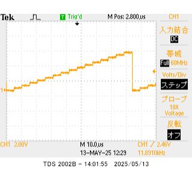
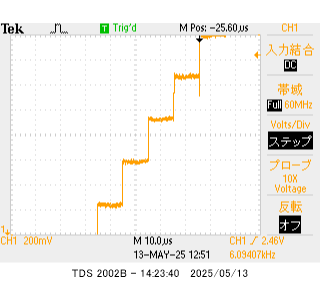
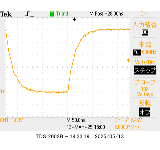

# DA変換の原理 レポート　3I44 吉髙 僚眞

## 目的
アナログ電圧をコンピュータで扱う場合はディジタル値に変換する。この処理を A/D 変換という。分解能 10 ビットの場合、基準電圧を５V とすると、5/210 V 毎（1024 段階）に量子化されることになる。ここでは４ビット逐次比較型を扱う。また同時に、データシートを用いたプログラミングについて学ぶ.

## 実験1. 抵抗ラダー型D/A

1.  AVR に４ビット DA 変換回路を接続し、Vo に PB（PB3 PB2 PB1 PB0）にほぼ比例した電圧が出力されることを確かめよ。
    
    ### プログラム
    ```c
    #include <asf.h> //int.c
    #define F_CPU 20000000UL
    #include <util/delay.h>

    void io_init(void);

    int main (void)
    {
	    io_init(); //IO ポート設定
	    while(1){
		    for(int i=0; i<16; i++){
			    PORTB = i;
			    _delay_us(5);
		    }
	    }
	    return 0;
    }

    void io_init(void) //IO ポート設定
    {
	    DDRB = 0b00001111;
	    // +---------- PB0~3 を出力に設定
	    return;
    }
    ```

    ### 波形
    

    0b00000001~0b00001111まで順に5μ秒ごとに出力したところ、階段状の波形が見られたことから、ほぼ比例した電圧が出力されていることがわかる。

2.  DA 変換回路の最小分解能（１LSB）の電圧を測定せよ。

    ### 波形
    

    先ほどと同様のプログラムでオシロスコープの設定を変更したところ、このような図を得ることができた。この図から、各出力電圧の差が300mV~400mVほどになっていることがわかる。
    計算してみると、
    $$
    \frac{5}{2^{4}} = 0.3125
    $$
    より 312.5mVとなり、おおよそ妥当な値だとわかる。

3.  PB にディジタル値の最小値、最大値を交互に繰り返し与え、Vo の変化を観察せよ。また Vo が安定するまでの時間（遅延時間）を求めよ。安定するまでの時間とは電圧誤差が最小分解能（１LSB）以内に収まるまでの時間とせよ。

    ### プログラム
    ```c
    // ・・・省略
    int main (void)
    {
	    io_init(); //IO ポート設定
	    PORTB = 0b00000000;
	    while(1){
		    PORTB ^= 0b00001111;
	    }
	    return 0;
    }
    //　・・・省略
    ```

    ### 波形
    

    波形を見ると、0Vから5V近くになるまでおおよそ150n秒(3×50)ほどかかっていることがわかる。

## 実験2. コンパレータ

1. テキスト「コンパレータの使い方」をもとにコンパレータを設定し、動作を確認しなさい。V+に三角波（ファンクションジェネレータ）、V-に定電圧（３V）を与えオシロスコープで確認すること。

    ### テキスト「コンパレータの使い方」より
    #### 3. 概要
    > ① 比較器を使用するには、ACDを `ON` する。 (論理値0にする)
    >
    > ② 入力端子は＋端子の`AIN0`と－端子の`AIN1`であり、この電圧を比較する。
    >
    > ③ 比較するには、ACBGを論理値`0`、ACMEを論理値`1`またはADENを論理値`0`にすればよい。
    >
    > ④ 比較結果は`ADC`に出力される。
    >
    > ⑤ この図の他、以下のページ、項目を参照する。
    >  `243` ページ `Table 23-1`
    >
    >  `12` ページ `Figure1-1`
    >
    >  `97` ページ `Table 14-9`
    >
    #### 4. ピン配置
    > ⑥ ピン配置は、図`1-1` 、表`14-9`を参照すればよい。
    >
    > ⑦ AIN0 はポート`D`の`6`ビット目、ICの`12`番ピンである。
    >
    > ⑧ AIN1 はポート`D`の`7`ビット目、ICの`13`番ピンである。
    >

    #### 5.省電力設定
    > ⑨ ADC については、`246`ページに書かれている。
    >
    > ⑩ ADC を使用するためには、PRADC を論理値`0`にする。
    > 
    > PRADCの配置されているレジスタを探す
    >
    > ⑪ PRADCは`PRR`レジスタの`0`ビット目である。
    >
    > ⑫ PRADCが論理値`1`のとき、コンパレータは ADC input MUX を使用できない。
    >  
    > ⑬ ディジタル入力にはディセーブル機能があり、`DIDR1`レジスタ（`245`ページ）、`DIDR0`レジスタ（`260`ページ）で設定する。
    >
    > ⑭ AIN1,AIN0を使用する場合、AIN1D, AIN0Dを論理値`1`にセットし、ディジタル入力バッファをディセーブルにすることができる。ADC5～0 も同様
    >
    #### 6.そのほかのパラメータ
    > ⑮ ACME は`ADCSRB`レジスタの`6`ビット目である。
    > 論理値`0`のとき、－入力端子 AIN1 がコンパレータに接続される。
    >
    > ⑯ ADEN は`ADCSRA`レジスタの`7`ビット目である。
    > 論理値`0`のとき、ADC が OFF になる。
    >
    > ⑰ ACO は`ACSR`レジスタの`5`ビット目である。コンパレータ出力端子。
    >
    > ⑱ ACD は`ACSR`レジスタの`7`ビット目である。
    > 論理値`1`のとき、コンパレータが OFF になる。
    >
    > ⑲ ACBG は`ACSR`レジスタの`6`ビット目である。
    > 論理値`1`のとき、＋入力端子 AIN０がコンパレータに接続される。
    >
    > ⑳ ACD は論理値`1`で比較器の電源が OFF になる。
    > 21 ACO には`1~2`クロック分のディレイが発生する。
    >
    #### 7.まとめ
    今回の目的で、０に設定するビット、１に設定するビットは次のようになる。
    | レジスタ | アドレス | 0に設定するビット | 1に設定するビット |
    | --- | --- | --- | --- |
    | PRR | PRADC | 0 |     |
    | ACSR | ACD, ACBG | 7 | 6 |
    | ADCSRB | ACME | 6 |     |
    | ADCSRA | ADEN |   | 7 |
    | DIDR0 | ADC0~5 |   | 0,1,2,3,4,5 |
    | DIDR1 | AIN0D, AIN1D |   | 0, 1 |