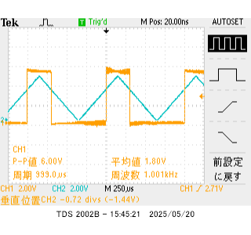

# DA変換の原理 レポート　3I44 吉髙 僚眞

## 目的
アナログ電圧をコンピュータで扱う場合はディジタル値に変換する。この処理を A/D 変換という。分解能 10 ビットの場合、基準電圧を５V とすると、5/210 V 毎（1024 段階）に量子化されることになる。ここでは４ビット逐次比較型を扱う。また同時に、データシートを用いたプログラミングについて学ぶ.

## 実験1. 抵抗ラダー型D/A

1.  AVR に４ビット DA 変換回路を接続し、Vo に PB（PB3 PB2 PB1 PB0）にほぼ比例した電圧が出力されることを確かめよ。
    
    ### プログラム
    ```c
    #include <asf.h> //int.c
    #define F_CPU 20000000UL
    #include <util/delay.h>

    void io_init(void);

    int main (void)
    {
	    io_init(); //IO ポート設定
	    while(1){
		    for(int i=0; i<16; i++){
			    PORTB = i;
			    _delay_us(5);
		    }
	    }
	    return 0;
    }

    void io_init(void) //IO ポート設定
    {
	    DDRB = 0b00001111;
	    // +---------- PB0~3 を出力に設定
	    return;
    }
    ```

    ### 波形
    

    0b00000001~0b00001111まで順に5μ秒ごとに出力したところ、階段状の波形が見られたことから、ほぼ比例した電圧が出力されていることがわかる。

2.  DA 変換回路の最小分解能（１LSB）の電圧を測定せよ。

    ### 波形
    

    先ほどと同様のプログラムでオシロスコープの設定を変更したところ、このような図を得ることができた。この図から、各出力電圧の差が300mV~400mVほどになっていることがわかる。
    計算してみると、
    $$
    \frac{5}{2^{4}} = 0.3125
    $$
    より 312.5mVとなり、おおよそ妥当な値だとわかる。

3.  PB にディジタル値の最小値、最大値を交互に繰り返し与え、Vo の変化を観察せよ。また Vo が安定するまでの時間（遅延時間）を求めよ。安定するまでの時間とは電圧誤差が最小分解能（１LSB）以内に収まるまでの時間とせよ。

    ### プログラム
    ```c
    // ・・・省略
    int main (void)
    {
	    io_init(); //IO ポート設定
	    PORTB = 0b00000000;
	    while(1){
		    PORTB ^= 0b00001111;
	    }
	    return 0;
    }
    //　・・・省略
    ```

    ### 波形
    

    波形を見ると、0Vから5V近くになるまでおおよそ150n秒(3×50)ほどかかっていることがわかる。

## 実験2. コンパレータ

1. テキスト「コンパレータの使い方」をもとにコンパレータを設定し、動作を確認しなさい。V+に三角波（ファンクションジェネレータ）、V-に定電圧（３V）を与えオシロスコープで確認すること。

    ### テキスト「コンパレータの使い方」より
    #### 3. 概要
    > ① 比較器を使用するには、ACDを `ON` する。 (論理値0にする)
    >
    > ② 入力端子は＋端子の`AIN0`と－端子の`AIN1`であり、この電圧を比較する。
    >
    > ③ 比較するには、ACBGを論理値`0`、ACMEを論理値`0`またはADENを論理値`1`にすればよい。
    >
    > ④ 比較結果は`ACO`に出力される。
    >
    > ⑤ この図の他、以下のページ、項目を参照する。
    >  `243` ページ `Table 23-1`
    >
    >  `12` ページ `Figure1-1`
    >
    >  `97` ページ `Table 14-9`
    >
    #### 4. ピン配置
    > ⑥ ピン配置は、図`1-1` 、表`14-9`を参照すればよい。
    >
    > ⑦ AIN0 はポート`D`の`6`ビット目、ICの`12`番ピンである。
    >
    > ⑧ AIN1 はポート`D`の`7`ビット目、ICの`13`番ピンである。
    >

    #### 5.省電力設定
    > ⑨ ADC については、`246`ページに書かれている。
    >
    > ⑩ ADC を使用するためには、PRADC を論理値`0`にする。
    > 
    > PRADCの配置されているレジスタを探す
    >
    > ⑪ PRADCは`PRR`レジスタの`0`ビット目である。
    >
    > ⑫ PRADCが論理値`1`のとき、コンパレータは ADC input MUX を使用できない。
    >  
    > ⑬ ディジタル入力にはディセーブル機能があり、`DIDR1`レジスタ（`245`ページ）、`DIDR0`レジスタ（`260`ページ）で設定する。
    >
    > ⑭ AIN1,AIN0を使用する場合、AIN1D, AIN0Dを論理値`1`にセットし、ディジタル入力バッファをディセーブルにすることができる。ADC5～0 も同様
    >
    #### 6.そのほかのパラメータ
    > ⑮ ACME は`ADCSRB`レジスタの`6`ビット目である。
    > 論理値`0`のとき、－入力端子 AIN1 がコンパレータに接続される。
    >
    > ⑯ ADEN は`ADCSRA`レジスタの`7`ビット目である。
    > 論理値`0`のとき、ADC が OFF になる。
    >
    > ⑰ ACO は`ACSR`レジスタの`5`ビット目である。コンパレータ出力端子。
    >
    > ⑱ ACD は`ACSR`レジスタの`7`ビット目である。
    > 論理値`1`のとき、コンパレータが OFF になる。
    >
    > ⑲ ACBG は`ACSR`レジスタの`6`ビット目である。
    > 論理値`0`のとき、＋入力端子 AIN０がコンパレータに接続される。
    >
    > ⑳ ACD は論理値`1`で比較器の電源が OFF になる。
    > 21 ACO には`1~2`クロック分のディレイが発生する。
    >
    #### 7.まとめ
    今回の目的で、０に設定するビット、１に設定するビットは次のようになる。
    | レジスタ | アドレス | 0に設定するビット | 1に設定するビット |
    | --- | --- | --- | --- |
    | PRR | 0x64 PRADC | 0  |   |
    | ACSR | 0x30(0x50) ACD, ACBG | 7, 6 |  |
    | ADCSRB | 0x7B ACME | 6 |    |
    | ADCSRA | 0x7A ADEN |   | 7 |
    | DIDR0 | 0x7E ADC0~5 |   | 0,1,2,3,4,5 |
    | DIDR1 | 0x7F AIN0D, AIN1D |   | 0, 1 |
    #### 8.遅延時間、タイミング

    > 比較器の遅延時間(Propagation Delay)を調べる。表 30-1 の DC 特性を参照する。表から2.7Vで`750`ns（標準）、4Vで`500`ns（標準）である。遅延時間は一般に電圧が高いほど短くなるから、5Vでは`480`ns（最大）*と予想する。これは、20MHz動作で`10`クロック(`0.48`us)に相当する。
    >
    > さらに ACO がセットされるまでに`2`クロック必要だから、比較器への入力が安定後、合計`12`クロック（`0.6`us）必要であることがわかる。

    #### 9.プログラミング基礎知識（補足）
    
    > 22 例えば、 PINB`0x03`番地、PORTB`0x05`番地、DDRB`0x04`番地 PRR`0x64`番地
    >
    > 23 IN, OUT命令は`0x00 - 0x3F`番地のアドレスに対して使用
    >
    > 24 LDS, STS命令は`0x60 - 0xFF`番地のアドレスに対して使用
    >
    > 25 SBI, CBI命令は`0x00 - 0x1F`番地のアドレスに対して使用
    >

    ### プログラム
    ```c
    #include <asf.h> //int.c
    #define F_CPU 20000000UL
    #include <util/delay.h>

    void io_init(void);

    int main (void)
    {
	    io_init(); //IO ポート設定
	    PORTB = 0b00000000;
	    while(1){
    		if( (ACSR & (1<<5)) !=0){
	    		PORTB = 0b00010000;
		    }else{
		    	PORTB = 0b00000000;
		    }
		    _delay_us(0.6);
	    }
	    return 0;
    }

    void io_init(void) //IO ポート設定
    {
	    PRR    = PRR & (~(1<<0));
	    ACSR   = ACSR & (~(1<<6));
	    ACSR   = ACSR & (~(1<<7));
	    ADCSRB = ADCSRB & (~(1<<6));
	    ADCSRA = ADCSRA | (1<<7);
	    DIDR0  = DIDR0 | (1<<0);
	    DIDR0  = DIDR0 | (1<<1);
	    DIDR0  = DIDR0 | (1<<2);
	    DIDR0  = DIDR0 | (1<<3);
	    DIDR0  = DIDR0 | (1<<4);
	    DIDR0  = DIDR0 | (1<<5);
	    DIDR1  = DIDR1 | (1<<0);
	    DIDR1  = DIDR1 | (1<<1);
    
	    DDRB   = 0b00010000;
	    return;
    }
    ```

    ### 波形
    

## 実験3. A/D変換
1. アセンブリ言語を用いてプログラムを作成せよ。

    ### program
    ```armasm
    .include "m328Pdef.inc"
    .CSEG

    INIT:
	    LDS R18, PRR
	    ANDI R18, (~(1 << 0))
	    STS PRR, R18

	    LDS R18, ACSR
	    ANDI R18, (~(1<<6))
	    ANDI R18, (~(1<<7))
	    STS ACSR, R18

	    LDS R18, ADCSRB
	    ANDI R18, (~(1<<6))
	    STS ADCSRB, R18

	    LDS R18, ADCSRA
	    ORI R18, (1 << 7)
	    STS ADCSRA, R18

    	LDS R18, DIDR0
	    ORI R18, (1 << 0)
	    ORI R18, (1 << 1)
	    ORI R18, (1 << 2)
	    ORI R18, (1 << 3)
	    ORI R18, (1 << 4)
	    ORI R18, (1 << 5)
	    STS DIDR0, R18
	
    	LDS R18, DIDR1
	    ORI R18, (1 << 0)
	    ORI R18, (1 << 1)
	    STS DIDR1, R18
	
	    LDS R18, 0b00011111
	    OUT DDRB, R18
    START:
	    ;全体の回数を保存するレジスタ
	    LDI R20, 4
	    ;ビットの桁数を保存するレジスタ
	    LDI R21, 0b00001000
	    ;出力する状態を保存するレジスタ
	    LDI R22, 0b00000000
	    OUT PORTB, R17
    LOOP:
	    OR R22, R21
	    LSR R21 
	    ; 1回目 0b00001000
	    ; 2回目 0b00000100

	    OUT PORTB, R22
	
	    ;待ち処理 3回分 50ns * 3 = 150ns
	    NOP
	    NOP
	    NOP

	    IN R18, ACSR
	    ANDI R18, (1 << 5)
	    BRNE DOWN

    	SUBI R20, 1
	    BRNE LOOP
	    RJMP FIN
    DOWN:
	    MOV R23, R21
	    COM R23
	    AND R22, R23

    	;例: 2回目の処理
	    ; R22 0b000001100;
	    ; R23 0b111111011;
	    ;     0b000001000;

    	OUT PORTB, R22
	    ;待ち処理
	    NOP
	    NOP
	    NOP

	    SUBI R20, 1
	    BRNE LOOP
	    RJMP FIN
    FIN:
	    RJMP FIN
    ```