# 赤外線リモコン（受信） レポート　3I44 吉髙 僚眞

## 目的
赤外線リモコンは 38KHz の搬送波を用いた通信機器である。ここでは、マイコン“ATmega328p”を用いて赤外線リモコンを作成し、動作を学ぶ。

## 実験1 波形解析

## 1. オフボタン

### **全体**
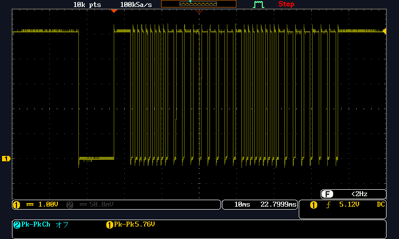

### **リーダーコード**
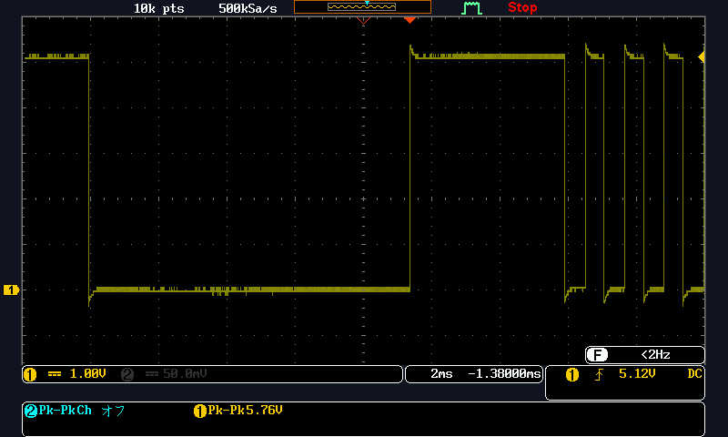

### **カスタムコード `0b00000000`**
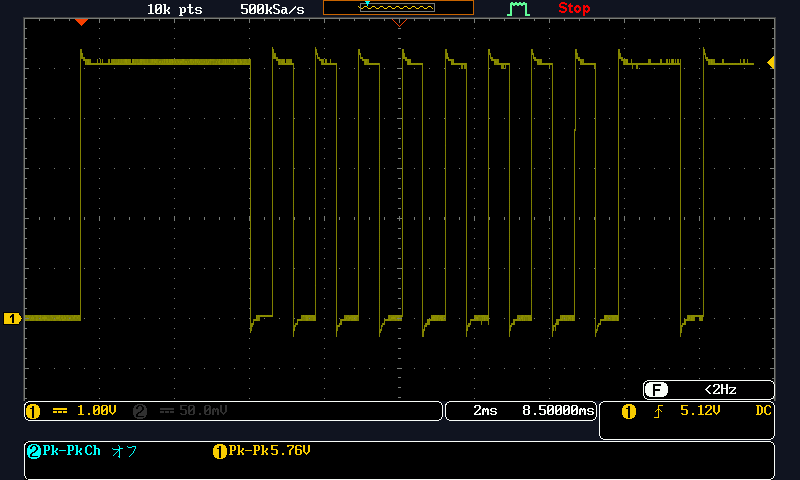


### **反転カスタムコード `0b11111111`**
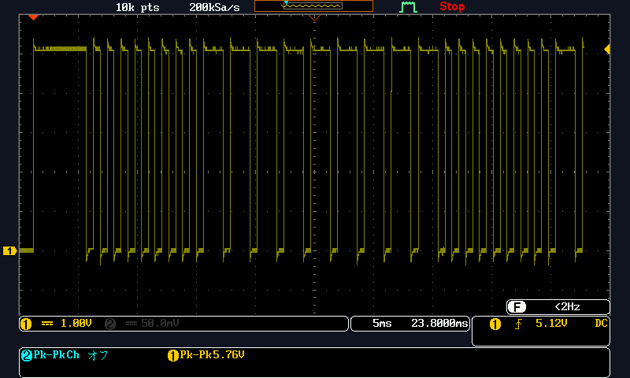


### **データコード `0b00000000`**
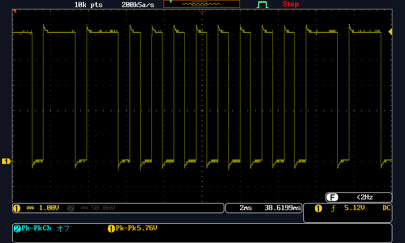


### **反転データコード `0b11111111`**
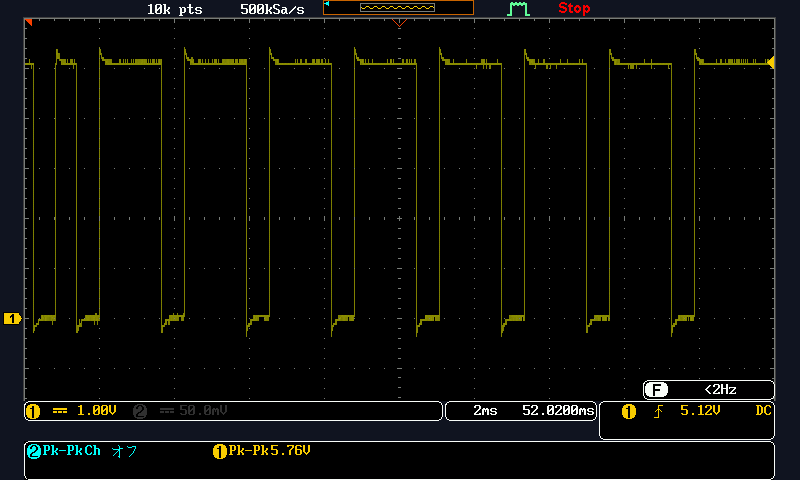


## 2. オン(明)

### **全体**
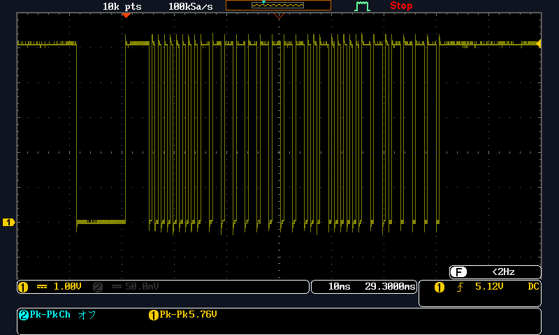

### **データコード `0b00001001`**
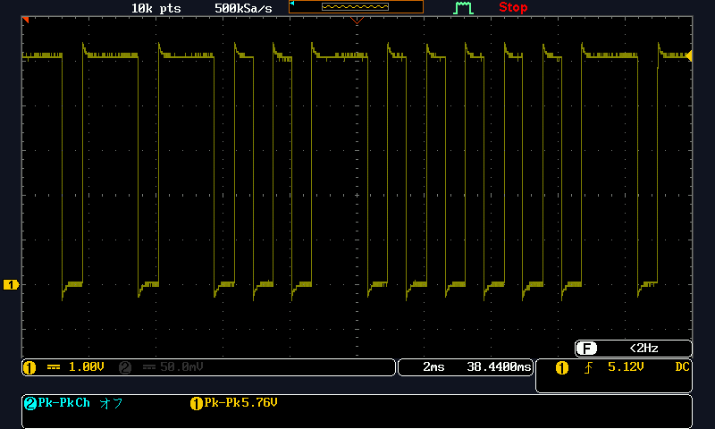


### **反転データコード `0b11110110`**
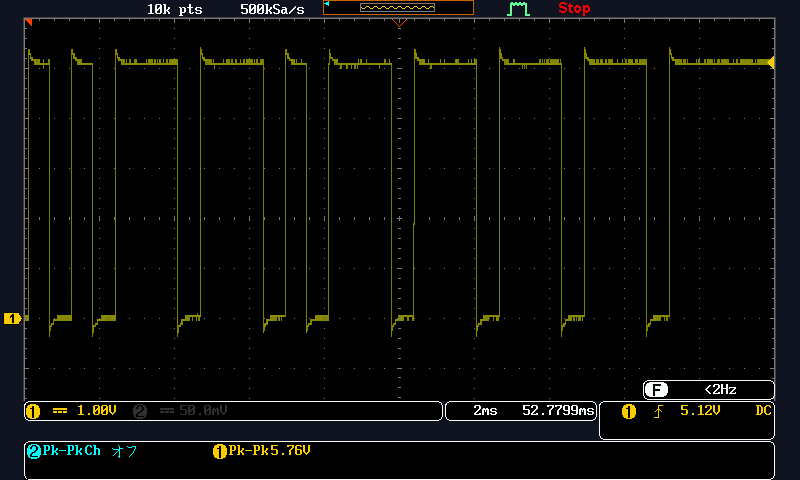


## 3. オン(暗)

### **全体**
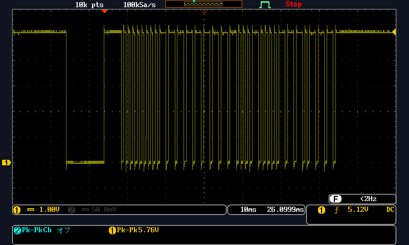

### **データコード `0b0010001`**
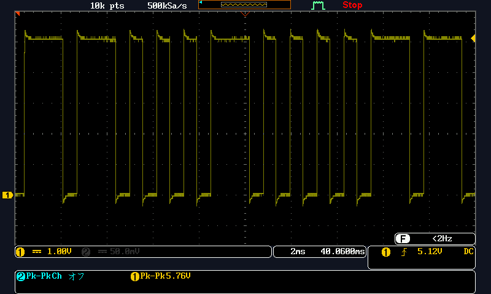

### **反転データコード `0b11101110`**


```
注意！
リトルエンディアンであることに注意して考える
```

## 実験2 リーダコードの受信
AVR ボードの INT1 端子に受信モジュールを接続する(図 3)。リモコンを操作し、LED（PB5）の点灯、消灯を反転するプログラムを完成し、リーダコードが受信できることを確認しなさい。

### プログラム

``` c
// リーダコードの受信
#include <asf.h>
void io_init(void);
void start(void);
void timer0_ctcmode_init(uint8_t top);

// コメント
// 9ms = 9*10^3μsの時で考える
// 最大の1024分周時 0.05*1024=51.2μs
// この時のトップ値は 9*10^3/51.2 = 175.78
//
// 次に大きい256分周時 0.05*256=12.8μs
// この時のトップ値は 9*10^3/12.8 = 703.125
// これは8ビットを超えているので分周は1024で設定する必要がある

// リーダコード許容範囲（カウンタ値）プリスケーラ設定 1024 分周
#define LEADER_LMIN (uint8_t)158 // 9ms x 90%
#define LEADER_LMAX (uint8_t)193 // 9ms x 110%
#define LEADER_HMIN (uint8_t)79	 // 4.5ms x 90%
#define LEADER_HMAX (uint8_t)97	 // 4.5ms x 110%
#define TIME_OUT (uint8_t)195	 // 10ms

// ステート定義
enum
{
	LEADER_LOW,
	LEADER_HIGH,
	START_READING
} State,
NEXT_State;

int main(void)
{
	io_init(); // I/O ポート初期設定
	start();   // 受信スタート
	sei();
	while (1)
	;
	return 0;
}

void start(void) // 受信スタート
{
	EICRA = 0b00001000; // 外部割り込み（INT1）を立ち下がりに設定
	// 立下り時の設定
	// 2ビット目 ISC10 = 0
	// 3ビット目 ISC11 = 1

	EIMSK = 0b00000010; // 外部割り込み有効
	// 1ビット目 INT1 割り込み有効

	NEXT_State = LEADER_LOW; // 次の状態は LEADER_HIGH
	return;
}

ISR(INT1_vect) // 外部割り込みサブルーチン
{
	uint8_t intv = 0;	// パルス幅
	State = NEXT_State; // ステート更新
	switch (State)
	{
		case LEADER_LOW:
		TCNT0 = 0;					   // タイムカウンタリセット
		timer0_ctcmode_init(TIME_OUT); // タイムアウト設定（タイマ／カウンタ０）
		TIMSK0 = 0b00000010;		   // タイムアウト有効（コンペアマッチ A 割り込み）
		EICRA = 0b00001100;			   // 外部割り込みを立ち上がりにセット
		NEXT_State = LEADER_HIGH;	   // 次の状態へ
		break;
		case LEADER_HIGH:
		intv = TCNT0; // タイムカウンタ読み込み
		if (LEADER_LMIN <= intv && intv <= LEADER_LMAX)
		{								// L レベルが範囲内なら
			TCNT0 = 0;					// タイムカウンタリセット
			EICRA = 0b00001000;			// 外部割り込みを立ち下がりにセット
			NEXT_State = START_READING; // 次の状態へ
		}
		else // 範囲外ならリスタート
		start();
		break;
		case START_READING:
		intv = TCNT0; // タイムカウンタ読み込み
		if (LEADER_HMIN <= intv && intv <= LEADER_HMAX)
		{						  // H レベルが範囲内なら
			EIMSK = 0b000000000;  // 外部割り込み停止
			TIMSK0 = 0b000000000; // タイムアウト停止（タイマ０割込み）
			PORTB ^= 0b00100000;  // 受信完了、LED 反転
			start();
		}
		else // 範囲外ならリスタート
		start();
		break;
	}
	return;
}

void io_init(void) // I/O ポート設定
{
	DDRB = 0b00100000;  // LED(PB5)を出力に設定
	PORTB = 0b00000000; // LED 消灯
	DDRD = 0b00000000;  // 外部割り込み（INT1）を入力に設定
	// PD2,INT0が共通
	// PD3,INT1が共有
	return;
}

ISR(TIMER0_COMPA_vect) // タイムアウト検出
{
	start();
	return;
}
// タイムアウト設定
// タイマ／カウンタ０ CTC モード
// top : カウンタ最大値

void timer0_ctcmode_init(uint8_t top)
{
	OCR0A = top;		 // タイマ／カウンタ 0 最大値
	TCCR0A = 0b00000010; // CTC モード
	TCCR0B = 0b00000101;			 // CTC モード、プリスケーラ設定1024分周
	//以下のように設定
	//0ビット目 CS00 1
	//1ビット目 CS01 0
	//2ビット目 CS02 1
	return;
}
```

### 波形
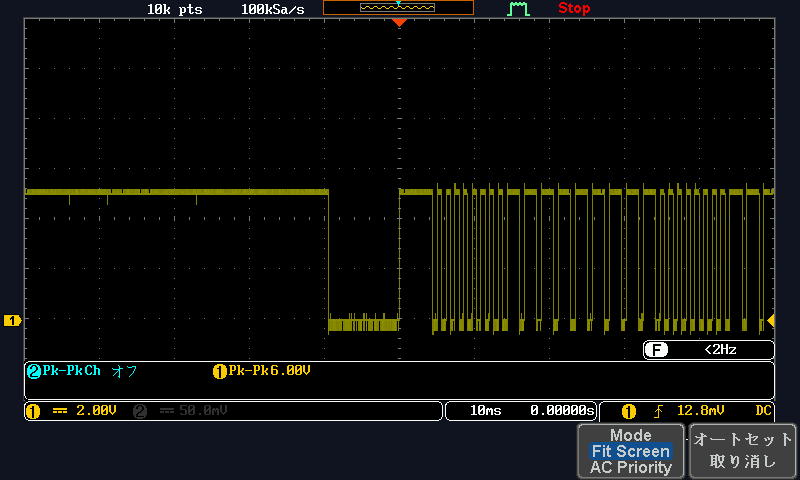

ボタンを押すことでLEDのオンオフが切り替わることが確認できた。
波形のようなリーダーコードの部分で受信していることがわかった。

## 実験3 データの受信

### プログラム
```c
// データの受信
#include <asf.h>
void start(void);
void timer0_ctcmode_init(uint8_t top);
void timer1_ctcmode_init(uint16_t top);
void io_init(void);
int8_t receive_bit(uint8_t intv);
#define LEADER_LMIN (uint8_t)158 // 9ms x 90%
#define LEADER_LMAX (uint8_t)193 // 9ms x 110%
#define LEADER_HMIN (uint8_t)79  // 4.5ms x 90%
#define LEADER_HMAX (uint8_t)97  // 4.5ms x 110%
#define D1_TMIN (uint8_t)39      // 2.25ms x 90%
#define D1_TMAX (uint8_t)48      // 2.25ms x 110%
#define D0_TMIN (uint8_t)19      // 1.125ms x 90%
#define D0_TMAX (uint8_t)24      // 1.125ms x 110%
#define TIME_OUT (uint8_t)195    // 10ms

#define CUSTOM1_CODE (uint8_t)0x00
#define CUSTOM2_CODE (uint8_t)0xFF
#define OFF_CODE 0x01         // OFF ボタン
#define LIGHT_CODE 0b00001001 // ON(明)ボタン
#define DARK_CODE 0b00010001  // ON(暗)ボタン

enum
{
    LEADER_LOW,
    LEADER_HIGH,
    START_READING,
    CUSTOM1,
    CUSTOM2,
    DATA1,
    DATA2,
    END,
    Error
} State,
    NEXT_State;

uint8_t bit_pos = 0, recv_custom1_code = 0, recv_custom2_code = 0, recv_data1_code = 0, recv_data2_code = 0;
int8_t bit;

int main(void)
{
    io_init();
    start();
    sei();
    while (1)
        ;
    return 0;
}
void io_init(void) // I/O ポート設定
{
    DDRB = 0b00100000;  // LED(PB5)を出力に設定
    PORTB = 0b00000000; // LED 消灯
    DDRD = 0b00000000;  // 外部割り込み端子（INT1）を入力に設定
    return;
}

void start(void) // 受信スタート
{
    EICRA = 0b00001000; // 外部割り込み（INT1）立ち下がり設定
    EIMSK = 0b00000010; // 外部割り込み（INT1）有効
    NEXT_State = LEADER_LOW;
    return;
}

ISR(INT1_vect)
{
    uint8_t intv = 0;
    State = NEXT_State; // ステート更新
    switch (State)
    {
    case LEADER_LOW:                   // 立ち下がりエッジ
        TCNT0 = 0;                     // タイムカウンタリセット
        timer0_ctcmode_init(TIME_OUT); // タイムアウト設定
        TIMSK0 = 0b00000010;           // 割り込み有効（コンペアマッチ A）
        EICRA = 0b00001100;            // 立ち上がり割り込みをセット
        NEXT_State = LEADER_HIGH;      // 次の状態へ
        break;
    case LEADER_HIGH: // 立ち上がりエッジ
        intv = TCNT0; // タイムカウンタ読み出し
        if (LEADER_LMIN <= intv && intv <= LEADER_LMAX)
        {                               // L レベルが範囲内なら
            TCNT0 = 0;                  // タイムアウトカウンタリセット
            EICRA = 0b00001000;         // 立ち下がり割り込みをセット
            NEXT_State = START_READING; // 次は START_READING
        }
        else
        { // 範囲外ならリスタート
            start();
        }
        break;
    case START_READING: // 立ち下がりエッジ
        intv = TCNT0;   // タイムカウンタ読み出し
        if (LEADER_HMIN <= intv && intv <= LEADER_HMAX)
        {                          // H レベルが範囲内なら
            TCNT0 = 0;             // タイムカウンタリセット
            recv_custom1_code = 0; // カスタムコード１初期設定
            bit_pos = 0b00000001;  // ビット位置設定（最下位ビットから）
            NEXT_State = CUSTOM1;  // 次は CUSTOM1
        }
        else
        { // 範囲外ならリスタート
            start();
        }
        break;
    case CUSTOM1:                // 立ち下がりエッジ
        intv = TCNT0;            // タイムカウンタ読み出し
        TCNT0 = 0;               // タイムカウンタリセット
        bit = receive_bit(intv); // １ビット受信
        if (bit < 0)
        { // 受信エラーならリスタート
            start();
        }
        else if (bit == 1)
        {
            recv_custom1_code |= bit_pos; // カスタムコードにセット
        }
        bit_pos <<= 1; // ビット位置をずらす
        if (bit_pos == 0)
        {                          // 8bit 受信したら
            recv_custom2_code = 0; // カスタムコード２初期設定
            bit_pos = 0b00000001;  // ビット位置設定（最下位ビットから）
            NEXT_State = CUSTOM2;  // 次は CUSTOM2
        }
        break;
    case CUSTOM2:                // 立ち下がりエッジ
        intv = TCNT0;            // タイムカウンタ読み出し
        TCNT0 = 0;               // タイムカウンタリセット
        bit = receive_bit(intv); // １ビット受信
        if (bit < 0)
        { // 受信エラーならリスタート
            start();
        }
        else if (bit == 1)
        {
            recv_custom2_code |= bit_pos; // 反転カスタムコードにセット
        }
        bit_pos <<= 1; // ビット位置をずらす
        if (bit_pos == 0)
        { // 8bit 受信したら
            if ((recv_custom1_code ^ recv_custom2_code) != 0b11111111)
            {
                start(); // データが一致しないならリスタート
            }
            else
            {
                recv_data1_code = 0;  // データコード１初期設定
                bit_pos = 0b00000001; // ビット位置設定（最下位ビットから）
                NEXT_State = DATA1;   // 次は DATA1
            }
        }
        break;
    case DATA1: // 立ち下がりエッジ

        intv = TCNT0;            // タイムカウンタ読み出し
        TCNT0 = 0;               // タイムカウンタリセット
        bit = receive_bit(intv); // １ビット受信
        if (bit < 0)
        { // 受信エラーならリスタート
            start();
        }
        else if (bit == 1)
        {
            recv_data1_code |= bit_pos; // データコードにセット
        }
        bit_pos <<= 1;    // ビット位置をずらす
        if (bit_pos == 0) // 8bit 受信したら
        {
            recv_data2_code = 0;  // カスタムコード２初期設定
            bit_pos = 0b00000001; // ビット位置設定（最下位ビットから）
            NEXT_State = DATA2;   // 次は DATA2
        }
        break;
    case DATA2:
    {
        intv = TCNT0;            // タイムカウンタ読み出し
        TCNT0 = 0;               // タイムカウンタリセット
        bit = receive_bit(intv); // １ビット受信
        if (bit < 0)
        { // 受信エラーならリスタート
            start();
        }
        else if (bit == 1)
        {
            recv_data2_code |= bit_pos; // 反転でデータコードにセット
        }
        bit_pos <<= 1; // ビット位置をずらす
        if (bit_pos == 0)
        { // 8bit 受信したら
            if ((recv_data1_code ^ recv_data2_code) != 0b11111111)
            {
                start(); // データが一致しないならリスタート
            }
            else
            {                       // 8 ビット目で受信データが正しいなら
                State = END;        // データ受信終了
                NEXT_State = Error; // 次のデータがあれば受信エラー
            }
        }
    }
    case END:
        break;
    case Error: // 33bit 目があれば受信エラー
        start();
        break;
    }
}

ISR(TIMER0_COMPA_vect) // タイムアウト検出
{
    if (State == END)
    {                        // 受信完了
        TIMSK0 = 0b00000000; // タイマ０割り込み停止
        if (recv_data1_code == OFF_CODE)
        {                        // OFF スイッチ
            TIMSK1 = 0b00000000; // タイマ１割込停止、LED 消灯
            PORTB = 0b00000000;
        }
        else if (recv_data1_code == LIGHT_CODE)
        { // オン（明）スイッチ
            PORTB ^= 0b00100000;
            TCNT1 = 0;
            timer1_ctcmode_init(9766); // 0.5 秒間隔点滅
            TIMSK1 = 0b00000010;       // 割り込み有効（コンペアマッチ A 割り込み）
        }
        else if (recv_data1_code == DARK_CODE)
        { // オン（暗）スイッチ
            PORTB ^= 0b00100000;
            TCNT1 = 0;
            timer1_ctcmode_init(19531); // １秒間隔点滅
            TIMSK1 = 0b00000010;        // 割り込み有効（コンペアマッチ A 割り込み）
        }
        start();
    }
    else
    { // タイムアウトエラー
        start();
    }
}

ISR(TIMER1_COMPA_vect) // 受信処理
{
    PORTB ^= 0b00100000; // LED 反転(PB5)
}

int8_t receive_bit(uint8_t intv) // データ受信、チェック
{
    if (D0_TMIN <= intv && intv <= D0_TMAX)
        return 0; // データ０受信
    else if (D1_TMIN <= intv && intv <= D1_TMAX)
        return 1; // データ１受信
    else
        return -1; // 受信エラー
}

void timer0_ctcmode_init(uint8_t top)
{
    OCR0A = top;         // タイマ／カウンタ 0 最大値
    TCCR0A = 0b00000010; // CTC モード
    TCCR0B = 0b00000101; // CS02 CS01 CS00 プリスケーラ
}

void timer1_ctcmode_init(uint16_t top)
{
    OCR1A = top;         // タイマ／カウンタ 1 最大値
    TCCR1A = 0b00000000; // CTC モード
    TCCR1B = 0b00001101; // CS12:CS11:CS10 プリスケーラ
}
```


波形を出力するときには
20ms, 50msで動作させるため、以下のように変更した
```c
else if (recv_data1_code == LIGHT_CODE)
{ // オン（明）スイッチ
    //・・・
    timer1_ctcmode_init(390); // 20ms秒間隔点滅
    //・・・
}
else if (recv_data1_code == DARK_CODE)
{ // オン（暗）スイッチ
	//・・・
    timer1_ctcmode_init(976); // 50ms間隔点滅
	//・・・
}
```

### 波形
#### オン（明）
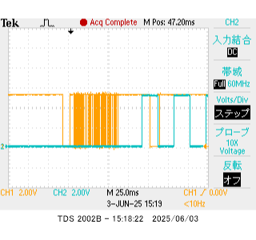

#### オン（暗）
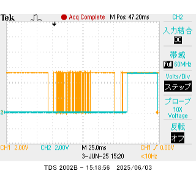

# 赤外線リモコン（搬送波）

## 目的
赤外線リモコンは搬送波を用いた通信機器である。ここでは、搬送波を作成および受信し、通信
の原理を学ぶ。

## 搬送波
マイコンのクロックは 20M Hz である。ここから、搬送波 38kHz を作成する。搬送波は周期を T (=`26.3us`) とすると、T/3 の点灯、2T/3 の消灯を繰り返した点滅信号である。ここでは、タイマ 0 割り込みを用いて点灯時間、消灯時間を交互に設定する。ここで、T/3=`8.77us`、 2T/3=`17.54`us である。点灯・消灯を状態変数 LED_state で管理する。

T/3 を、タイマ 0 割り込みを用いて作成する。タイマを用いれば
```
クロック       プリスケーラー       カウンタ
 20MHz    ->     1分周        ->    1分周    ->
          A                   B              C
```

Aの周期は1/20MHz = `0.05`us
Bの周期は`0.05`us × `175.4` = `8.77`us
Cの周期は`8.77`us × `2`     = `17.54`us

となるから、B 信号をカウンタで`2`回数えたタイミングで、マイコンに割り込みを行うと`17.54`us刻みの間隔を作ることができる。このとき、カウンタの最大値（top）は`2`になる。同様に、2T/3 の時間は最大値（top）を`2`として実現できる。


## 実験

LEDをD0に、スイッチをD1に接続する。

