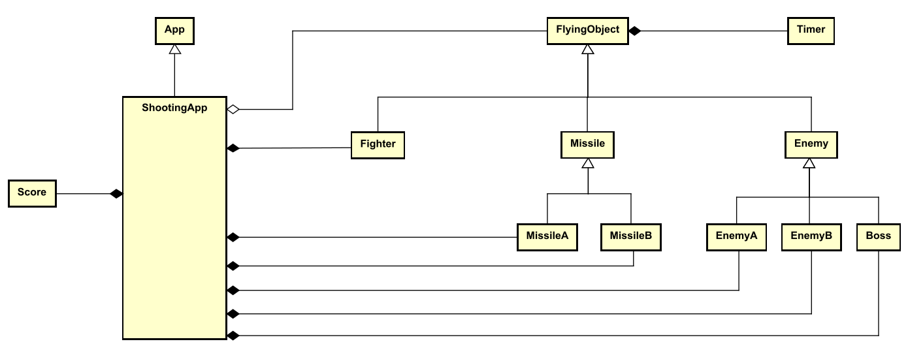
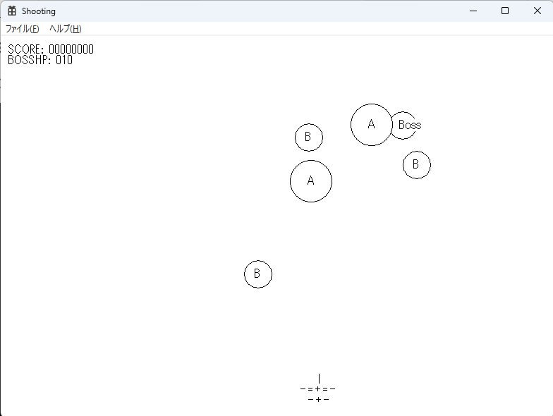
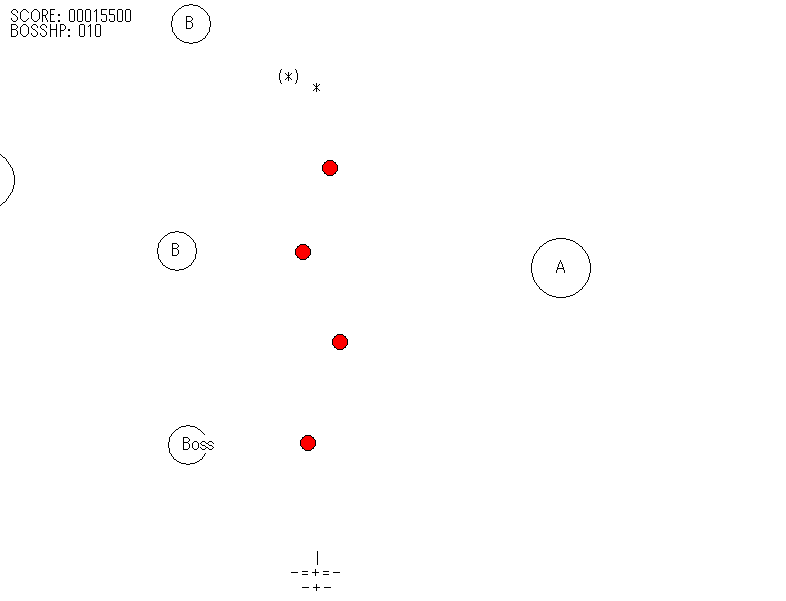
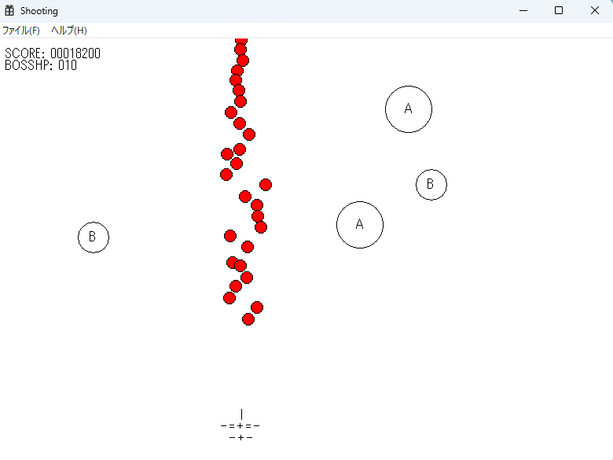
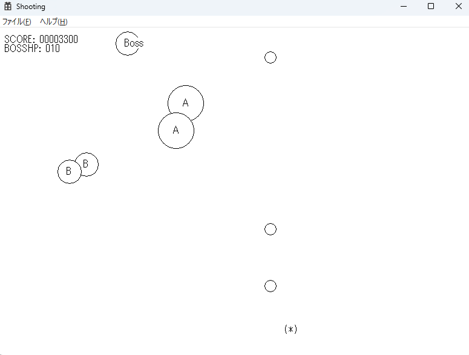

# プログラミング応用
2I44 吉髙 僚眞

## 実験の目的
* これまで学んだ知識・技術を総合的に活用すること
* これまでの知識を用いて、与えられたソースコードを理解すること
* デザインパターンやフレームワークの基礎知識を身に付けること
* クラス図の基礎知識を身に付けること

## 実験の概要
簡単なシューティングゲームを開発する。
その他の使用は各自で決める。
* ウィンドウサイズ
  - 横 800pixel、縦 600pixel
* 自機
  - 前後左右に平行移動する。
  - 画面中に最大 10 発までのミサイルを前方に向けて撃つことができる。
  - 敵機かミサイルに当たると消滅する。
* 敵機
  - 画面中に 5 機まで存在する。
  - 計算により移動経路を求める。
  - 画面中に 1 発のミサイルを前方に向けて撃つことができる。
  - 敵機以外に当たると消滅する。
* ミサイル
  - 直進的に移動する。
  - 他の飛行物体と当たると消滅する。 

## 考察
### クラスEnemyB
EnemyB.h

```c++
class EnemyB : public Enemy
{
    private:
        double phase;
    public:
	    EnemyB();
	    ~EnemyB();

        void init();
        void update();
        void draw();
};
```
EnemyB.cpp
```c++
#define _USE_MATH_DEFINES
#include <cmath>
#include "ShootingApp.h"
#include "EnemyB.h"

EnemyB::EnemyB():phase(0),Enemy()
{

}


EnemyB::~EnemyB()
{

}

void EnemyB::init() {
	FlyingObject::init();

	phase = App::rand() * M_PI;
	x = 100 + 600 * App::rand();
	y = 100 + 100 * App::rand();
	vx = 100 + 500 * App::rand();
	vy = 100 + 500 * App::rand();

	point = 500;

	radius = 20;
}


void EnemyB::update() {

	if (status & COLLISION) {
		if (etimer.get() > 0.5)
			cleanup();
		return;
	}

	double dt = elapsed.get();
	double mt = mtimer.get();
	double dx, dy;

	if (dt > 1.0 / 30)
		dt = 1.0 / 30;
	
	dy = vx * sin(2 * mt + phase) * dt;
	dx = vy * cos(5 * mt + phase) * dt;

	x += dx;
	y += dy;

	elapsed.reset();
}

void EnemyB::draw()
{
	if (status & COLLISION) {
		drawExplosion();
		return;
	}

	Ellipse(App::hDC, x - radius, y - radius, x + radius, y + radius);

	LPCWSTR c = TEXT("B");
	TextOut(App::hDC, (int)x - 6, (int)y - 10, c, lstrlen(c));
}
```
#### 説明
EnemyAと基本的な挙動は同じですが、初速度や初期座標を少し変更しました。移動範囲や動作の幅を広げました。
> ``` c++
> x = 100 + 600 * App::rand();
> y = 100 + 100 * App::rand();
> vx = 100 + 500 * App::rand();
> vy = 100 + 500 * App::rand();
> ```
 

### クラスScore
Score.h
```c++
class Score
{
public:
	int score;

	void init();
	void add(int point);
	void draw(int x, int y);
};

```
Score.cpp
```c++
#include "App.h";
#include "Score.h"

void Score::init() {
	score = 0;
}

void Score::add(int point) {
	score += point;
}

void Score::draw(int x, int y) {
	TCHAR str[32];
	wsprintf(str, TEXT("SCORE: %08d"), score);
	TextOut(App::hDC, x, y, str, lstrlen(str));
}
```

***
### 応用課題

#### 応用課題1
Missile.cpp
```c++
#include "Missile.h"

Missile::Missile():FlyingObject() {

}

Missile::~Missile() {

}

void Missile::init()
{

}

void Missile::update()
{

}


void Missile::draw()
{

}

void Missile::fire(double x, double y, double vx, double vy)
{
	this->x = x;
	this->y = y;
	this->vx = vx;
	this->vy = vy;
}
```
MissileA.h
```c++
#pragma once
#include "Missile.h"
class MissileA : public Missile
{
public:
	MissileA();
	~MissileA();
	void init();
	void update();
	void draw();
	void fire(double x, double y, double vx, double vy);
};
```
MissileA.cpp
```c++
#include "MissileA.h"
#include "ShootingApp.h";

MissileA::MissileA():Missile() {

}
MissileA::~MissileA() {

}

void MissileA::init()
{
	FlyingObject::init();
	vx = vy = 0;
	radius = 10;
}


void MissileA::update()
{
	if (status & COLLISION) {
		if (etimer.get() > 0.5)
			cleanup();
		return;
	}

	if (x < 0 || x > 799 || y < 0 || y > 599)
		cleanup();
	double dt = elapsed.get();
	x += vx * dt;
	y += vy * dt;
	elapsed.reset();
}  


void MissileA::draw()
{
	if (status & COLLISION) {
		drawExplosion();
		return;
	}

	Ellipse(App::hDC, x - radius, y - radius, x + radius, y + radius);
}


void MissileA::fire(double x, double y, double vx, double vy)
{
	this->x = x;
	this->y = y;
	this->vx = vx;
	this->vy = vy;
}
```
MissileB.h
```c++
#pragma once
#include "Missile.h"
class MissileB : public Missile
{
public:
	MissileB();
	~MissileB();
	void init();
	void update();
	void draw();
	void fire(double x, double y, double vx, double vy);
};
```
MissileB.cpp
```c++
#define _USE_MATH_DEFINES
#include <cmath>
#include "MissileB.h"
#include "ShootingApp.h"

MissileB::MissileB():Missile()
{

}
MissileB::~MissileB()
{

}

void MissileB::init()
{
	FlyingObject::init();
	vx = vy = 0;
	radius = 8;
}

void MissileB::update()
{
	if (status & COLLISION) {
		if (etimer.get() > 0.5)
			cleanup();
		return;
	}

	if (x < 0 || x > 799 || y < 0 || y > 599)
		cleanup();
	double dt = elapsed.get();
	double mt = mtimer.get();
	double dx, dy;
	dx = vx * sin(5 * mt) * dt;
	dy = vy * dt;

	x += dx;
	y += dy;
	elapsed.reset();
}


void MissileB::draw()
{
	if (status & COLLISION) {
		drawExplosion();
		return;
	}

	SelectObject(App::hDC, GetStockObject(DC_BRUSH));
	SetDCBrushColor(App::hDC, RGB(255, 0, 0));
	Ellipse(App::hDC, x - radius, y - radius, x + radius, y + radius);
}

void MissileB::fire(double x, double y, double vx, double vy)
{
	this->x = x;
	this->y = y;
	this->vx = vx;
	this->vy = vy;
}
```
Fighter.h
``` c++
class Fighter : public FlyingObject{
private:
	unsigned int dir;
	std::vector<MissileA*> missilesA;
	std::vector<MissileB*> missilesB;
public:
	//省略
	void shootA();
	void shootB();
};
```

Fighter.cpp
``` c++
//それ以外は省略
void Fighter::shootA() {
	for (size_t i = 0; i < missilesA.size(); i++) {
		if (!(missilesA[i]->status & ACTIVE)) {
			missilesA[i]->init();
			missilesA[i]->fire(x, y - radius, 0, -400);
			SoundManager::getInstance()->request(TEXT("shoot"));
			return;
		}
	}
}
void Fighter::shootB() {
	for (size_t i = 0; i < missilesB.size(); i++) {
		if (!(missilesB[i]->status & ACTIVE)) {
			missilesB[i]->init();
			missilesB[i]->fire(x, y - radius,( App::rand() - 0.5) * 200, -400);
			SoundManager::getInstance()->request(TEXT("shoot"));
			return;
		}
	}
}
```

ShootingApp.cpp
```c++
//省略
void ShootingApp::keyDown(WPARAM key) 
{
	switch (key) 
	{
		case VK_LEFT:
			fighter.move(Fighter::LEFT);
			break;
		case VK_RIGHT:
			fighter.move(Fighter::RIGHT);
			break;
		case VK_UP:
			fighter.move(Fighter::FORE);   
			break;
		case VK_DOWN:
			fighter.move(Fighter::BACK);
			break;
		//変更&追加
		case VK_SPACE:
			fighter.shootA();
			break;
		case 0x41:
			fighter.shootB();
			break;
	}
}
```
#### 説明
MissileBは少し赤い色に変更して、動作はまっすぐでなく、sinを使って波のように飛ぶようにしました。また、はMissileAもMissileBも動くようにほかのプログラムも上記のように変更しました。

<br>
<br>

***

#### 応用課題2 
Enemy.h
```c++
  // 省略
	virtual int collide_score();

```
Enemy.cpp
```c++
//省略
int Enemy::collide_score() {
	return point;
}
```

ShootingApp.cpp
```c++
//省略
for (size_t i = 0; i < enemies.size(); i++)
{
	if(!(enemies[i]->status & FlyingObject::ACTIVE))
		continue;
	
	for (size_t j = 0; j < missiles.size(); j++)
	{
		if (enemies[i]->checkCollision(missiles[j]))
		{
			score.add(enemies[i]->collide_score());
		}
			
	}
	enemies[i]->checkCollision(&fighter);
}
```

Boss.h
```c++
#pragma once
#include "Enemy.h"
class Boss : public Enemy
{
private:
	int hitpoint;
	double orbit;
	double phase;
public:
	Boss();
	~Boss();

	void init();
	void update();
	void draw();
	int collide_score();
};


```

Boss.cpp
```c++
#define _USE_MATH_DEFINES
#include "Boss.h"
#include "ShootingApp.h"

Boss::Boss():orbit(0),phase(0),hitpoint(0), Enemy()
{

}


Boss::~Boss()
{

}

void Boss::init() {
	FlyingObject::init();

	phase = App::rand() * M_PI;	// M_PIはπ

	x = 100 + 500 * App::rand();
	y = 100 + 100 * App::rand();

	vx = 3 * App::rand();
	vy = 3 * App::rand();

	point = 9999999;
	hitpoint = 10;
	radius = 20;

	phase = App::rand() * M_PI;
	orbit = 5;
}

void Boss::update() {
	
	

	if (status & COLLISION){
		if (hitpoint <= 0)
		{
			if (etimer.get() > 0.5)
				cleanup();
		}
		else {

			status = ACTIVE;
		}
		return;
	}

	double dt = elapsed.get();
	double mt = mtimer.get();

	if (dt > 1.0 / 30)
		dt = 1.0 / 30;

	if(orbit <= 6)
		orbit += 0.01;

	if (vx <= 5)
		vx += 0.001;
	if (vy <= 5)
		vy += 0.001;

	x = cos(mt) * vx * orbit + x;
	y = sin(mt) * vy * orbit + y;

	elapsed.reset();
}

void Boss::draw()
{
	TCHAR hp[20];
	wsprintf(hp, TEXT("BOSSHP: %03d"), hitpoint);
	TextOut(App::hDC, 10, 25, hp, lstrlen(hp));

	if ((status & COLLISION)&&(hitpoint <= 0)) {
		drawExplosion();
		return;
	}

	Ellipse(App::hDC, x - radius, y - radius, x + radius, y + radius);

	LPCWSTR c = TEXT("Boss");
	TextOut(App::hDC, (int)x - 6, (int)y - 10, c, lstrlen(c));
}

int Boss::collide_score()
{
	if (hitpoint > 0)
	{
		hitpoint--;
		return 0;
	}
	else {
		return point;
	}
}
```
#### 説明
BossはEnemyを継承しつつ、HPを持ち一回ではやられず何回か攻撃を受けてから倒れるという仕様にしました。移動は楕円を描きながら、速度は徐々に早くなっていく、描く楕円も徐々に広がるというように倒すのが難しいように難易度調整をしました。また、ポリモーフィズム的にBossの衝突も他のEnemyなどと同じように処理ができるように、collide_score()を使ってポイント追加の処理を行うように変更しました。

### クラス図


### スクリーンショット






<br><br>

## 感想
この授業を通してC++などでClassを使ったアプリ開発をどうやってやるかが何となく理解できました。わかりやすいプログラムを書くためにはポリモーフィズムやクラスの関係(汎化・集約・コンポジションなど)をうまく使用することが大事だとよくわかりました。