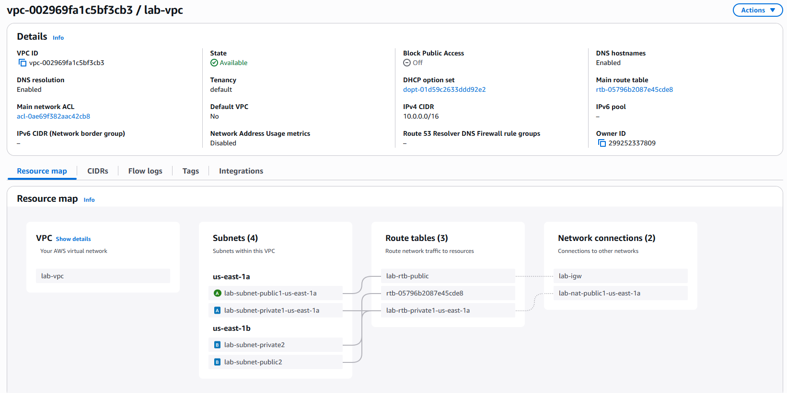
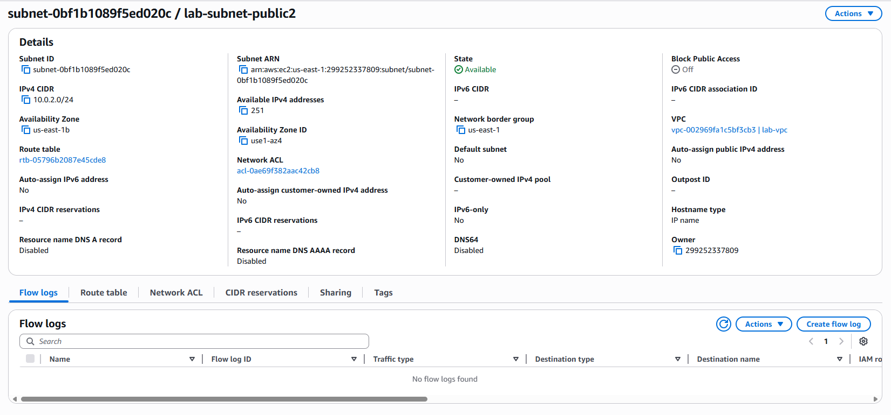

# AWS 3I44 吉髙僚眞
## ラボ 2 : VPC を構築し、Webサーバーを起動する[Lab 2]
### 目的
* AWS上に仮想ネットワークを作成し、VPCを配置し、ウェブサーバを起動する手順を理解する

* Amazon Virtual Private Cloud (VPC) を使用して独自の VPC を作成し、コンポーネントを追加して、カスタマイズしたネットワークを作成する。 
* セキュリティグループも作成する。
* ウェブサーバーを実行する
* EC2 インスタンスの設定とカスタマイズを行い、この EC2 インスタンスを起動して、VPC のサブネットで実行する

### 手順

### タスク 1: VPC を作成する

このタスクでは、VPC コンソールで [VPC and more] オプションを使用して、VPC、インターネットゲートウェイ、パブリックサブネット、単一のアベイラビリティーゾーン内のプライベートサブネット、2 つのルートテーブル、NAT ゲートウェイなど複数のリソースを作成します。

作成したVPC

### タスク 2: 追加のサブネットを作成する

> このタスクでは、2 番目のアベイラビリティーゾーンで、VPC のためにさらに 2 つのサブネットを作成します。 VPC 内の複数のアベイラビリティーゾーンにサブネットがあると、高可用性を提供するソリューションのデプロイに役立ちます。 
> 
> このように VPC を作成した後でも、さらにサブネットを追加するなど、設定を追加することができます。 作成するサブネットはすべて完全に単一のアベイラビリティーゾーン内に配置されます。

サブネット

ルートテーブル

### タスク 3: VPC セキュリティグループを作成する
> このタスクでは、仮想ファイアウォールとして機能する VPC セキュリティグループを作成します。 インスタンスの起動時に、1 つ以上のセキュリティグループをインスタンスに関連付けます。 各セキュリティグループにルールを追加すると、関連付けられたインスタンスの双方向のトラフィックを許可できます。

### タスク 4: ウェブサーバーインスタンスを起動する
> このタスクでは、Amazon EC2 インスタンスを新しい VPC で起動します。 このインスタンスがウェブサーバーとして機能するように設定します。

作成したインスタンス

### 結果

点数

Web表示

### 作成したシステム構成図（ネットワーク、VPCを含む）

### 理解したこと、理解していないこと

理解したこと
* AWS上ではVPCを使って作成するインスタンスなどが所属するネットワークを管理している
* VPC内にサブネットを追加していくことができ、サブネットごとに設定を変更することができる。
  * 「このサブネットはhttpでアクセスできる」　「このサブネットは外部からアクセスできない」など
* セキュリティグループを作成することで特定のアクセスだけを許可することができる

理解していないこと
* NATゲートウェイの設定がいまいちわかっていないかもしれない

---

## ラボ 3 : Amazon EC2 の紹介[Lab 3]
### 目的
* AWS EC2のVPCでストレージを追加する方法とその意味、モニタリング方法を理解する
### 手順

### タスク 1: Amazon EC2 インスタンスを起動する
> このタスクでは、終了保護と停止保護を有効にした Amazon EC2 インスタンスを起動します。 終了保護は EC2 インスタンスが誤って終了されるのを防ぎ、停止保護は EC2 インスタンスが誤って停止されるのを防ぎます。 また、単純なウェブサーバーをデプロイするインスタンスの起動時に、ユーザーデータスクリプトを指定します。

作成したインスタンス

### タスク 2: インスタンスをモニタリングする
> モニタリングは、Amazon Elastic Compute Cloud (Amazon EC2) インスタンスと AWS ソリューションの信頼性、可用性、パフォーマンスを維持するうえで重要です。

システムログを取得した結果

スクリーンショットを使用した結果

### タスク 3: セキュリティグループを更新してウェブサーバーにアクセスする
> EC2 インスタンスを起動したときに、スクリプトによってウェブサーバーのインストールとシンプルなウェブページの作成を行いました。 このタスクでは、このウェブサーバーのコンテンツにアクセスします。

作成したセキュリティグループ

### タスク 4: インスタンスのサイズを変更する: インスタンスタイプと EBS ボリューム
> ニーズが変化するにつれて、インスタンスの使用率が高すぎる (インスタンスタイプが小さすぎる) ことや低すぎる (インスタンスタイプが大きすぎる) ことに気付く場合があります。 この場合は、インスタンスタイプを変更できます。 例えば、t2.micro インスタンスがワークロードに対して小さすぎる場合、m5.medium インスタンスに変更できます。 同様に、ディスクのサイズも変更できます。

変更後のインスタンス

### タスク 5: EC2 の制限について調べる
> Amazon EC2 には、利用可能なさまざまなリソースが用意されています。 利用できるリソースには、イメージ、インスタンス、ボリューム、スナップショットなどがあります。 AWS アカウントを作成すると、これらのリソースに対して、各リージョンに基づくデフォルトの制限が適用されます。

EC2の制限

### タスク 6: 停止保護をテストする
> インスタンスにアクセスする必要はないが、保持したい場合は、インスタンスを停止することができます。 このタスクでは、終了保護の使用方法を学習します。

停止保護のエラー

停止状態

### 理解したこと、理解していないこと

理解したこと
* EC2ではサーバーをクラウド上に作成することができて、そのサーバの管理などを行うことができる。
* 管理するためのシステムログの取得や、ターミナルの状態を取得できるツールが提供されている。
* インスタンスのタイプやストレージの大きさも後から簡単に変更することができる。
* セキュリティルールを使用して特定のアクセスだけを許可することによりセキュリティを高めている。
* 停止保護などの機能もあり、サーバーインスタンスに関して細かく設定ができる。

## 課題
> AWS以外のクラウド環境を一つ挙げ、今回作成したVPCと仮想マシン、Webサーバからなるシステムを構成するのに、どのサービス選択し、どのように使えばよいか調べよ。

GCP (Google Cloud Platfrom)の場合

GCPにはEC2に対応するCompute Engine(以降GCE)がある。GCEではVMインスタンスを作成することができ、EC2とほとんど同様の手順で作成することができる。AWSのVPCに類するGCPのVPCネットワークというサービスがあり、それを使用することで同様のシステムを構成することができる。
