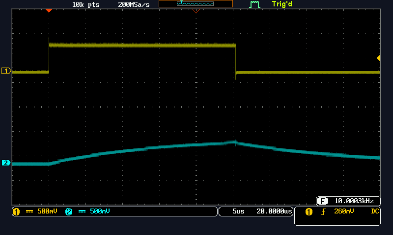
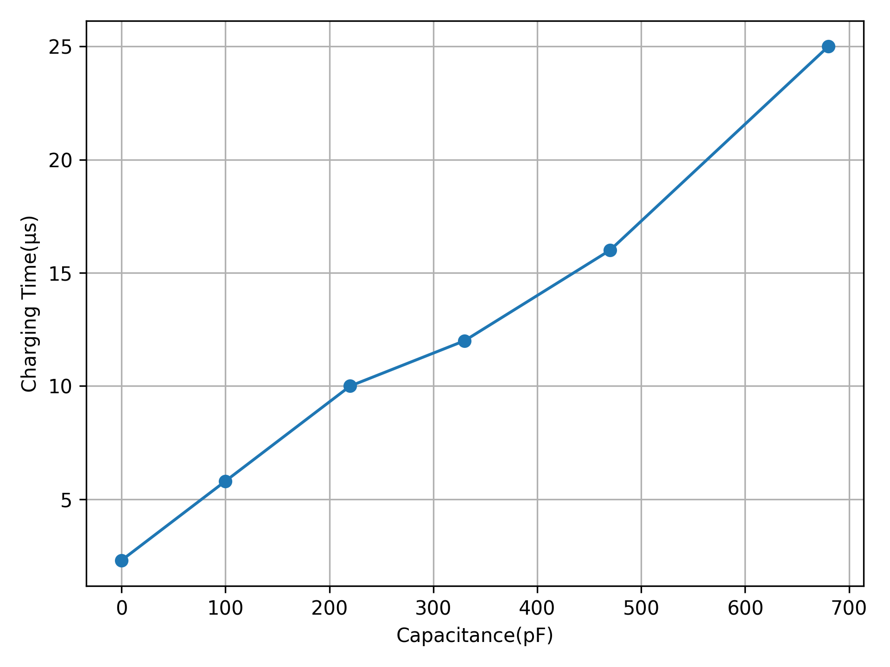

# コンデンサとタッチセンサ 3I44 吉髙僚眞

## 実験1
> タイマ０を用いて PD0 から方形波を出力し、波形 PD7 端子の波形を記録しなさい。コンデンサ C を 100pF(101 と表記),330pF(331),680pF(681)とせよ。


### プログラム
```c
#include <asf.h>

void io_init(void);
void timer0_ctcmode_init(uint8_t top);

int main(void)
{
    io_init();                // IOポート設定
    timer0_ctcmode_init(249); // タイマ0設定
    sei();
    while (1);
    return 0;
}

void io_init(void) // IOポート設定
{
    DDRD |= (1 << DDD0);     // PD0を出力設定
    PORTD &= ~(1 << PORTD0); // PD0にLOWを出力
}

ISR(TIMER0_COMPA_vect) // タイマ0コンペアマッチA割り込みサービスルーチン
{
    PORTD |= (1 << PORTD0);
}

ISR(TIMER0_COMPB_vect) // タイマ0コンペアマッチB割り込みサービスルーチン
{
    PORTD &= ~(1 << PORTD0);
}

// タイマ0 CTC モード
void timer0_ctcmode_init(uint8_t top)
{
    OCR0A = top;        // 比較値A（TOP値）を設定
    OCR0B = OCR0A >> 1; // 比較値Bを設定（中央値）
    TCCR0A = 0b00000010;
    // ++ WGM01:WGM00 CTCモード top=OCR0A
    TCCR0B = 0b00000010;
    // |+++ CS12:CS11:CS10 8分周
    // +--- WGM02 CTCモード top=OCR0A
    // WGM02 → 0
    // CS12:CS11:CS10 → 010 8分周
    TCNT0 = 0; // カウンタクリア
    TIMSK0 = 0b00000110;
    // |+- OCIE0A //比較値A 割り込み許可
    // +-- OCIE0B //比較値B 割り込み許可
}
```

### 波形

#### 100pFの時


#### 330pFの時


#### 680pFの時


## 実験2
> 閾電圧(VT)を求めよ。またコンパレータによる割り込み（割り込みベクタ ANALOG_COMP_vect ） を追加する。コンデンサCを0pF（取り外す）,100pF,220pF,330pF,470pF,680pF として、PD0 の HIGH レベル幅を計測し、グラフに表しなさい。

### プログラム
```c
//V- AIN1 PD7#include <asf.h>
#include <asf.h>

void io_init(void);
void timer0_ctcmode_init(uint8_t top);
void comparator_init(void);

int main(void)
{
	comparator_init();
	io_init();                // IOポート設定
	timer0_ctcmode_init(249); // タイマ0設定
	sei();
	while (1)
	;
	return 0;
}

void io_init(void) // IOポート設定
{
	DDRD |= (1 << DDD0);     // PD0を出力設定
	PORTD &= ~(1 << PORTD0); // PD0にLOWを出力
}

ISR(TIMER0_COMPA_vect) // タイマ0コンペアマッチA割り込みサービスルーチン
{
	PORTD |= (1 << PORTD0);
	ACSR |= 1 << ACIE; // コンパレータ割込み有効（ノイズ対策）
}

ISR(TIMER0_COMPB_vect) // タイマ0コンペアマッチB割り込みサービスルーチン
{
	PORTD &= ~(1 << PORTD0);
}

ISR(ANALOG_COMP_vect) // アナログコンパレータ割り込みサービスルーチン
{
	PORTD &= ~ (1 << PORTD0);
	ACSR &= ~(1 << ACIE); // コンパレータ割込み無効（ノイズ対策）
}

void comparator_init(void)
{
	DDRD &= ~(1 << PORTD6); // V+ AIN0 PD6
	DDRD &= ~(1 << PORTD7); //V- AIN1 PD7
	
	ADCSRB &= ~(1 << ACME); // AIN1 セレクト
    
	// *** 割り込み設定 ***
	ACSR |= (1 << ACIE); // 割り込みを有効にする
    ACSR &= ~(1 << ACIS0);
	ACSR |= (1 << ACIS1); 
    // AIN0 セレクト、//AIN0 ＜ AIN1 で割り込み
    // アナログコンパレータの割り込みは出力のところを見ている。
    // 今の条件 最初: AIN0 > AIN1 出力 HIGH
    //    割り込み時: AIN0 < AIN1 出力 LOW
    // 出力がHIGHからLOWに変わるから設定はFalling Output Edgeにする

	ACSR &= ~(1 << ACBG);   
	ACSR &= ~(1 << ACD);

}

// タイマ0 CTC モード
void timer0_ctcmode_init(uint8_t top)
{
	OCR0A = top;        // 比較値A（TOP値）を設定
	OCR0B = OCR0A >> 1; // 比較値Bを設定（中央値）
	TCCR0A = 0b00000010;
	// ++ WGM01:WGM00 CTCモード top=OCR0A
	TCCR0B = 0b00000010;
	// |+++ CS12:CS11:CS10 8分周
	// +--- WGM02 CTCモード top=OCR0A
	// WGM02 → 0
	// CS12:CS11:CS10 → 010 8分周
	TCNT0 = 0; // カウンタクリア
	TIMSK0 = 0b00000110;
	// |+- OCIE0A //比較値A 割り込み許可
	// +-- OCIE0B //比較値B 割り込み許可
}
```

### 波形/測定

### 0pF 約2.3us (レンジ: 1us)


### 100pF 約5.8us (レンジ: 2us)


### 220pF 約10us (レンジ: 5us)


### 330pF 約12us (レンジ: 5us)


### 470pF 約16us (レンジ: 5us)


### 680pF 約25us  (レンジ: 5us)


### グラフ



静電容量と充電時間にはおよそ比例のような関係がある。

## 実験3
> C を取り外した状態で、ワニ口ケーブルで延ばし、P とする。P（金属部分）を手で触れ、PD0 の HIGH レベル幅を計測しなさい。

### 波形/計測


手で触れて計測したところ、およそ6~7us(レンジ: 5us)ほどとなった。
先ほどの実験で100pFが約5.8usとなったことから、静電容量は100pFよりも少し多いくらい(100~120pF)だと考えられる。


## 実験4
> P（金属部分）を手で触れたとき、LED が点灯するようにしてみよ。LED を消灯するには基板の RESET スイッチを使ってよい。閾値はどのように設定すべきか考えること。

### 閾値の計算
top値の設定により249の時、50usなので` 249 ÷ 50 × 7 = 34.86`となる。閾値は整数のみなので`34`を設定した。

### プログラム (変更箇所)
```c
//・・・省略

void io_init(void) // IOポート設定
{
	DDRD |= (1 << DDD0);     // PD0を出力設定
	DDRB |= (1 << DDB5); // ←追加 LED用出力設定
	PORTD &= ~(1 << PORTD0); // PD0にLOWを出力
	PORTB &= ~(1 << PORTB5); //　←追加
}

// ・・・省略

ISR(ANALOG_COMP_vect) // アナログコンパレータ割り込みサービスルーチン
{
	PORTD &= ~ (1 << PORTD0);
	ACSR &= ~(1 << ACIE); // コンパレータ割込み無効（ノイズ対策）

    //追加
	uint16_t width = 34;
	if(TCNT0 >= width){
		PORTB |= (1 << PORTB5);
	}
}

// ・・・省略

```

## 実験5

### プログラム (変更箇所)
```c
// 省略

// ↓追加
ISR(TIMER1_COMPA_vect)
{
	PORTB &= ~(1 << PORTB5); //LEDを消灯
	TIMSK1 = 0b00000000; //タイマ1の割り込みを不可に
}

ISR(ANALOG_COMP_vect) // アナログコンパレータ割り込みサービスルーチン
{
	PORTD &= ~ (1 << PORTD0);
	ACSR &= ~(1 << ACIE); // コンパレータ割込み無効（ノイズ対策）

	uint16_t width = 34;
	if(TCNT0 >= width){
		PORTB |= (1 << PORTB5); //LEDを点灯
		timer1_ctcmode_init( 19531 ); // タイマ1設定 ←追加
	}
}


// 省略

// ↓追加設定 タイマ1
void timer1_ctcmode_init(uint16_t top)
{
	OCR1A = top;        // 比較値A（TOP値）を設定
	// CTCモード WGM13:WGM12:WGM11:WGM10 = 0:1:0:0
	TCCR1A &= ~(1 << WGM10);
	TCCR1A &= ~(1 << WGM11);
	TCCR1B |= (1 << WGM12);
	TCCR1B &= ~(1 << WGM13);
	// 分周の設定
	// CS12:CS11:CS10 = 1:0:1 1024分周
	// 1024分周の時top値は 10^5/51.2=19531
	// それ以外の場合はオーバーフローしてしまう
	TCCR1B |= (1 << CS10);
	TCCR1B &= ~(1 << CS11);
	TCCR1B |= (1 << CS12);
	
	TCNT1 = 0; // カウンタクリア
	TIMSK1 = 0b00000010;
	// |+- OCIE0A //比較値A 割り込み許可
}
```

## 考察１
> 実験 3 において、ワニ口ケーブル（非金属部分）を手で触れると HIGH レベル幅はどのように変化するだろうか。（注意）ケーブルの金属部分には触れないこと。

実際にやってみたところ、特に変化は起こらなかった。実験3では、手を金属部分に触れることで静電容量が変化することでHIGHレベル幅が変化したが、この場合では絶縁体に触れているため、静電容量がほとんど変化しないと考えられる。

## 考察2
> 巷に「手を近づけてください。」と書かれた自動ドアを見かける。この仕組みはどうなっているだろうか。調べよ。

自動ドアのセンサーの多くは今回の実験のような静電容量の変化を利用したタッチセンサーではない。自動ドアの上部に赤外線センサーがついており、「手を近づけてください。」と書かれたプレート周辺の狭いエリアとドア近辺の広いエリアに赤外線を照射して待機している。広いエリアの赤外線から何かの物体が近づくことを感知したのち、狭いエリアのプレートに手が近づけられるとドアが開く仕組みになっている。他にも赤外線ではなく超音波を利用したものや光線を利用したものなどもある。

#### 参考文献
* [ナブコ自動ドア | 自動ドアの仕組み](https://nabco.nabtesco.com/automatic-door/structure/)
* [京滋オート・ドアー株式会社 |「手を近づけてください」非接触タッチスイッチってどんな仕組み？](https://www.keijiautodoor.com/post/%E3%80%8C%E6%89%8B%E3%82%92%E8%BF%91%E3%81%A5%E3%81%91%E3%81%A6%E3%81%8F%E3%81%A0%E3%81%95%E3%81%84%E3%80%8D%E9%9D%9E%E6%8E%A5%E8%A7%A6%E3%82%BF%E3%83%83%E3%83%81%E3%82%B9%E3%82%A4%E3%83%83%E3%83%81%E3%81%A3%E3%81%A6%E3%81%A9%E3%82%93%E3%81%AA%E4%BB%95%E7%B5%84%E3%81%BF%EF%BC%9F)

## 考察3
> この実験で理解したことを述べなさい。

コンデンサのイメージがかなり掴めたと思います。コンデンサの充電には時間がかかること、蓄えた電荷が多くなるにつれ、回路に流れる電流が少なくなり、ゆっくり電圧が上昇することが実験を通してよく理解できました。
また、静電容量を利用したタッチセンサーについて理解できました。私は以前電気を通す糸を使ってタッチセンサー的なものを作りたいと考えており、静電容量を使った方法があることは知っていたのですが実際にどう静電容量の変化を検知するのかわかっていませんでした。今回の実験を通して、電圧が変化する時間を計測、比較することで静電容量の変化が検知できることがよくわかりました。