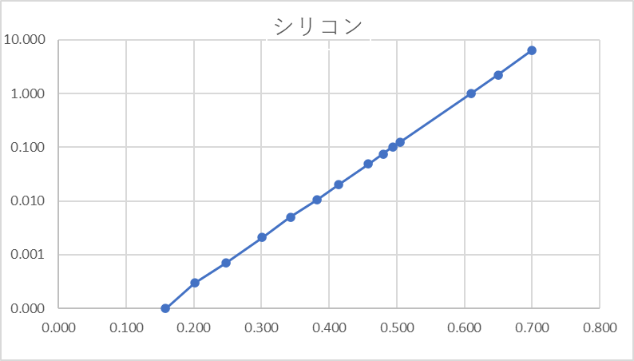
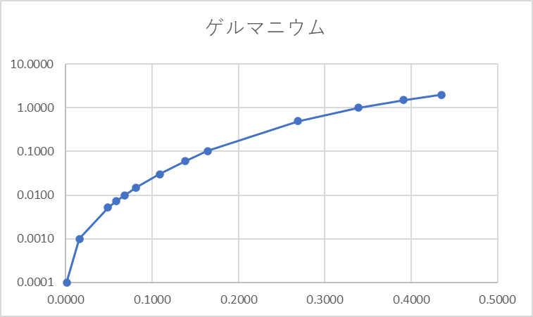
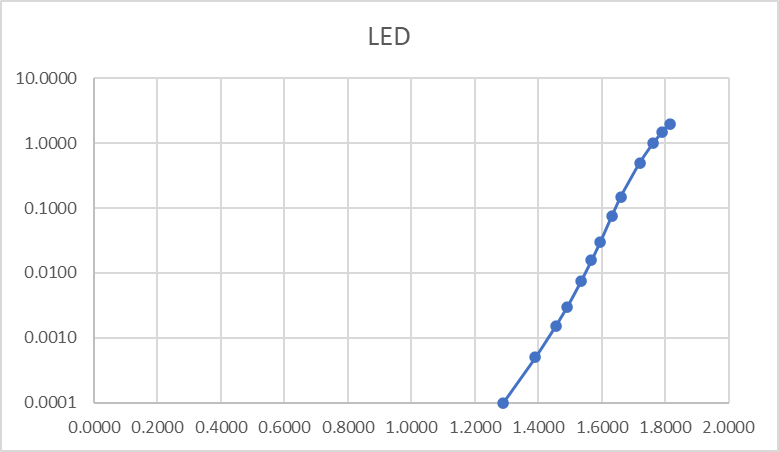
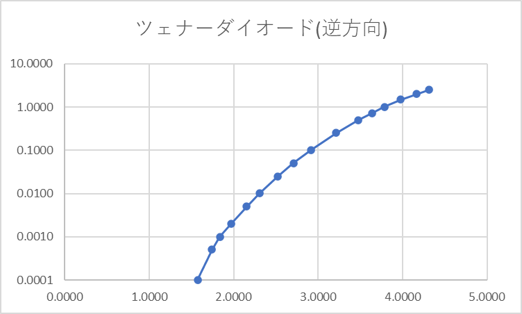

# ダイオードの特性

3I44 吉髙 僚眞 （共同実験者: 3I04 吉田 裕哉）

## 実施情報

### 環境
* 天候: くもり
* 気温: 22℃
* 湿度: 36%
* 使用装置: 
  * Desk43: マルチメータ(GWINSTEK GDM-B341), 電源装置(KENWOOD PR18-1.2A)
  * Desk44: マルチメータ(GWINSTEK GDM-B341)

## 結果
> 4.1. 観測したデータを、等間隔目盛と対数目盛りでそれぞれグラフに示しなさい。
> 
> 4.2. 実験１の結果から、それぞれのｎ値と Is を計算により求めなさい。（補足 参照）

### シリコン

| 電圧 [V] | 電流 [mA] |
|---------|-----------|
| 0.158 | 0.000 |
| 0.201 | 0.000 |
| 0.247 | 0.001 |
| 0.301 | 0.002 |
| 0.343 | 0.005 |
| 0.382 | 0.010 |
| 0.414 | 0.020 |
| 0.458 | 0.049 |
| 0.480 | 0.075 |
| 0.494 | 0.101 |
| 0.505 | 0.126 |
| 0.610 | 0.999 |
| 0.650 | 2.218 |
| 0.700 | 6.427 |

**n値: 1.909639342**

小さい方から3個目の値と10個目の値で計算した

### ゲルマニウム

| 電圧 [V] | 電流 [mA] |
|---------|-----------|
| 0.0011 | 0.0001 |
| 0.0160 | 0.0010 |
| 0.0487 | 0.0052 |
| 0.0587 | 0.0074 |
| 0.0684 | 0.0099 |
| 0.0817 | 0.0148 |
| 0.1087 | 0.0304 |
| 0.1380 | 0.0601 |
| 0.1644 | 0.1034 |
| 0.2690 | 0.4987 |
| 0.3388 | 0.9976 |
| 0.3914 | 1.5015 |
| 0.4355 | 2.0071 |

**n値: 1.566446**

小さい方から2個目の値と10個目の値で計算した

### LED

| 電圧 [V] | 電流 [mA] |
|---------|-----------|
| 1.2906 | 0.0001 |
| 1.3905 | 0.0005 |
| 1.4549 | 0.0015 |
| 1.4912 | 0.0030 |
| 1.5361 | 0.0076 |
| 1.5674 | 0.0156 |
| 1.5950 | 0.0301 |
| 1.6318 | 0.0748 |
| 1.6608 | 0.1492 |
| 1.7197 | 0.5021 |
| 1.7618 | 0.9992 |
| 1.7913 | 1.4999 |
| 1.8142 | 2.0062 |

**n値: 1.81556**

小さい方から3個目の値と11個目の値で計算した

## Zenner ダイオードの逆方向特性

### ツェナー

| 電圧 [V] | 電流 [mA] |
|---------|-----------|
| 1.5747 | 0.0001 |
| 1.7436 | 0.0005 |
| 1.8384 | 0.0010 |
| 1.9686 | 0.0020 |
| 2.1535 | 0.0050 |
| 2.3052 | 0.0101 |
| 2.5242 | 0.0249 |
| 2.7098 | 0.0501 |
| 2.9187 | 0.1028 |
| 3.2120 | 0.2537 |
| 3.4761 | 0.5019 |
| 3.6400 | 0.7301 |
| 3.7850 | 1.0030 |
| 3.9780 | 1.4784 |
| 4.1692 | 2.0100 |
| 4.3115 | 2.4910 |

## 考察・検討
> 5.1. ダイオードに多くの電流を流すと、内部抵抗ｒの影響が無視できなくなることを、図と文章を用いて説明しなさい。

> 5.2. この時の電流と電圧の関係を表すグラフの概要を説明しなさい。

> 5.3. ５V の電源を用いて、発光ダイオード（LED）に約２mA の電流を流したい。何オームの抵抗を用いればよいか計算しその回路図を描きなさい。但し、抵抗は E12 系列であるとする。

> 5.4. 実験で測定した以外のダイオードについて、その種類と利用例を調べて説明しなさい。

