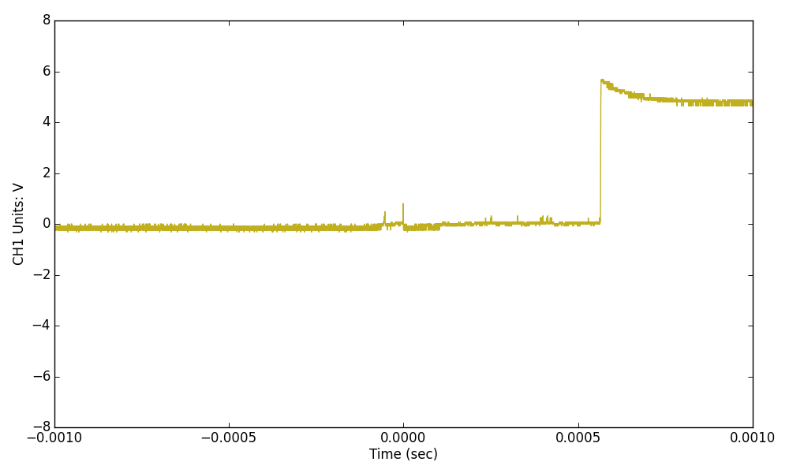

# AVR入門 点滅回路の製作 レポート

* 実験日：2024年12月12日
* 実験者：2I44 吉髙 僚眞

## 実験目的
* AVR の使用法の習得，AVR Studio (Microchip Studio) の使用法の習得、キットを用いた回路の製作に慣れる。


## 実験内容
* LED 点滅回路の製作する。

## ワーク1
* LED の点滅回路において、テストプログラムを実行せよ。
* なぜ約1 秒間隔となるのかについて説明せよ。クロック周波数20[MHz]である。

```armasm
T1S:
	LDI R23, 100
_T10MS:
	RCALL T10MS
	SUBI R23, 1
	BRNE _T10MS
	RET

T10MS:
	LDI R22, 100
_T100US:
	RCALL T100US
	SUBI R22, 1
	BRNE _T100US
	RET

T100US:
	LDI R21, 249
_TUS:
	NOP
	NOP
	NOP
	NOP
	NOP
	SUBI R21, 1
	BRNE _TUS
	NOP
	RET
```

 クロック周波数は20[MHz]なので、周波数は0.05[μs]である

 T100USではサイクルが1997となっていて、呼び出す際に3サイクル必要。T100USを実行するためには2000サイクル必要でかかる時間は`2000×0.05=100[μs]`となる。
 T10MSでは、T100USを100回呼び出すので`100×100=10000[μs]= 10[ms]`、
 T1Sでは、T10MSを100回呼び出すので`10×100=1000[ms]= 1[s]`となり、1秒を計測することができる。


## ワーク2
* テストプログラムを約0.8 秒点灯，0.2 秒消灯するように設定し，動作を報告せよ。

**プログラム**
```armasm
.include "tn2313def.inc"
.CSEG

START:
	LDI R16, low(RAMEND)
	OUT SPL, R16
	LDI R16, 0b11111111
	OUT DDRB, R16
LOOP:
	LDI R16, 0b01010101 ; ポイント1
	OUT PORTB, R16
	RCALL T08S
	LDI R16, 0b10101010 ; ポイント2
	OUT PORTB, R16
	RCALL T02S
	RJMP LOOP

T08S:
	LDI R20, 80
_TIMER08S:
	RCALL T10MS
	SUBI R20, 1
	BRNE _TIMER08S
	RET

T02S:
	LDI R19, 20
_TIMER02S:
	RCALL T10MS
	SUBI R19, 1
	BRNE _TIMER02S
	RET

T10MS:
	LDI R22, 100
_T100US:
	RCALL T100US
	SUBI R22, 1
	BRNE _T100US
	RET

T100US:
	LDI R21, 249
_TUS:
	NOP
	NOP
	NOP
	NOP
	NOP
	SUBI R21, 1
	BRNE _TUS
	NOP
	RET
```

**プログラム**

* `T02S:`の部分では20回10MS待機する、`T10MS`を呼び出すことで、`20×10=200` 0.2秒待つプログラムになっている。 
* `T08S:`の部分では80回10MS待機する、`T10MS`を呼び出すことで、`80×10=800` 0.8秒待つプログラムになっている。 

## ワーク3
* テストプログラムを約0.2 秒点灯，0.8 秒消灯するように設定し，動作を報告せよ。

ワーク2のプログラムのポイント1を見ると`PB0`は、LOW`PB1`はHIGHになっていて、ポイント2を見ると反対の`PB0`が、HIGH、`PB1`はLOWになっていることがわかる。そのため、`PB0`にさしていたLEDとつながるケーブルを`PB1`に接続することで反対の動作になる。

## ワーク4
* 押しボタンスイッチを押している間、約1 秒点灯，約1 秒消灯を繰り返すプログラム作成し、動作を報告せよ

**プログラム**
```armasm
START:
	LDI R16, low(RAMEND)
	OUT SPL, R16
	LDI R16, 0b00000000
	OUT DDRD, R16
	LDI R16, 0b11111111
	OUT DDRB, R16
	OUT PORTB, R16
LOOP:
	IN R17, PIND
	LSL R17
	LSL R17
	LSL R17
	LSL R17
	LSL R17
	LSL R17
	LSL R17
	BRNE LOOP
	RJMP BLINK
			 
BLINK:
	LDI R16, 0b10101010
	OUT PORTB, R16
	RCALL T1S
	LDI R16, 0b01010101
	OUT PORTB, R16
	RCALL T1S
	RJMP LOOP
    ;ワーク5の場合
    ;RJMP BLINK
```

#### ボタンを押している場合
* R17には`0b11111110`が入る。
* 7回左ビットシフトを行うと`0b00000000`となる。
* この時、`0`フラグがたつため`BRNE`では`BLINK`に分岐する
* 1回点滅させたらもう一度`LOOP`に戻る

#### ボタンを押していない場合
* R17には`0b11111111`が入る。
* 7回左ビットシフトを行うと`0b00000001`となる。
* この時、`0`フラグはたたないので`BRNE`では`LOOP`に分岐する

## ワーク5
* １度、押しボタンスイッチを押したら、約1 秒点灯，約1 秒消灯を繰り 返すプログラム作成し、動作を報告せよ。

ワーク4のプログラムで`BLINK`の最後に`RJMP BLINK`とすると、`LOOP`に戻らないため、一度押したら点滅し続けるプログラムができる。


## ワーク1

**ボタンを押している間だけLEDを1秒の間隔で点滅させるプログラム**
```c++
#include <avr/io.h>

#define F_CPU 20000000UL // 20MHz
#include <avr/io.h>
#include <util/delay.h>

void blink(void);

void io_init(){
	DDRB = 0b11111111; // PORTB 出力に設定
	DDRD = 0b00000000; // PORTD 入力に設定
	PORTB = 0b11111111; // LED出力を消す
}

int main(void)
{
	io_init();
	while (1)
	{
		_delay_ms(10); // チャタリング10ms待ち
		if (PIND & (1 << PIND0) ){
			PORTB = 0b11111111; // LED出力 off
			
		}
		else{
			blink();
		}
	}
}

void blink(void)
{
	PORTB = 0b10101010;
	_delay_ms(1000);
	PORTB = 0b01010101;
	_delay_ms(1000);
}
```


## ワーク2
* オシロスコープを使って、スイッチON時の入力波形を観察し、報告せよ。



ボタンを押してから200μs × 3、0.6m秒位の間は安定せず、ノイズがのる、チャタリングが起こることを確認できた。