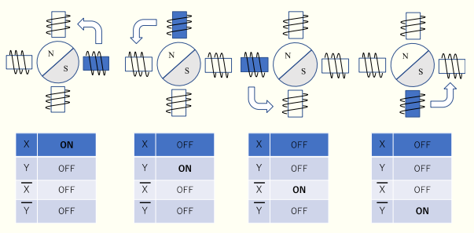
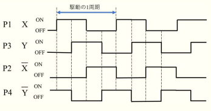

# AVR入門 ステッピングモータ制御 レポート

* 実験日：2024年1月09日
* 実験者：2I44 吉髙 僚眞

## 実験目的
* マイコンでステッピングモータが制御できる

## ワーク1 ステッピングモータの制御（1相励磁方式、正回転）
* ステッピングモータと制御出力ボードを接続し、図４の１相励磁方式を用いて、1ステップ1秒でステッピングモータを正回転させよ。（ステップ/回転 48、ステップ角 7.5°）

### プログラム
``` armasm
.include "tn2313def.inc"
.CSEG
START: 
	LDI R16, 0b11111111
	OUT DDRB, R16

ONE: ;1相励磁
	LDI R16, 0b00000001 ;☆0
	OUT PORTB, R16
	RCALL T1S
	LDI R16, 0b00000010 ;☆1
	OUT PORTB, R16
	RCALL T1S
	LDI R16, 0b00000100 ;☆2
	OUT PORTB, R16
	RCALL T1S
	LDI R16, 0b00001000 ;☆3
	OUT PORTB, R16
	RCALL T1S
	RJMP ONE

T1S:
	LDI R23, 100;
_T10MS:
	RCALL T10MS
	SUBI R23, 1
	BRNE _T10MS
	RET

T10MS: ; 0.1秒
	LDI R21, 100; T100US を10回呼び出し
_T100US:
	RCALL T100US
	SUBI R21, 1
	BRNE _T100US
	RET

T100US:
	LDI R22, 249; 249 回繰り返し
_TUS:
	NOP
	NOP
	NOP
	NOP
	NOP
	SUBI R22,1
	BRNE _TUS 
	NOP
	RET
```

### 説明
* `PORTB`に以下のように接続する。
  * B0 , X
  * B1 , Y
  * B2 , _X
  * B3 , _Y
* 図4のように回転させるため、プログラムの☆0~☆3に示すように順番に出力を変えていく。
  * 上記の対応関係より、図でON担っているときには1,OFF担っているときは0を出力するように設定する。
* 1ステップ1秒にするために、出力したのち1秒間待つ。
  * (1秒間待つプログラムは、点滅回路の時に使用したものと同じ)
* ループの最初に戻る。

#### 図4



## ワーク2 ステッピングモータの制御（2相励磁方式、正回転）
* ２相励磁方式を用いて、1ステップ1秒でステッピングモータを正回転させよ。（ステップ/回転 48、ステップ角 7.5°）

#### プログラム
``` armasm
.include "tn2313def.inc"
.CSEG
START: 
	LDI R16, 0b11111111
	OUT DDRB, R16

SECOND: ;2相励磁
	LDI R16, 0b00001001 ;☆0
	OUT PORTB, R16
	RCALL T1S
	LDI R16, 0b00000011 ;☆1
	OUT PORTB, R16
	RCALL T1S
	LDI R16, 0b00000110 ;☆2
	OUT PORTB, R16
	RCALL T1S
	LDI R16, 0b00001100 ;☆3
	OUT PORTB, R16
	RCALL T1S
	RJMP SECOND

T1S: 
	;以下はワーク1のコードと同様のため省略
```
### 説明
* 図3のように回転させるため、プログラムの☆0~☆3に示すように順番に出力を変えていく。
  * 以下のように対応しているので図でONになっているときに1,OFFになっているときに0を出力するように設定する。
    * B0 , X
    * B1 , Y
    * B2 , _X
    * B3 , _Y
* 1ステップ1秒にするために、出力したのち1秒間待つ。
* ループの最初に戻る。

### 図


## ワーク3 ステッピングモータの制御（反回転）
* 1ステップ1秒でステッピングモータを反転させよ。（ステップ/回転 48、ステップ角 7.5°）
#### プログラム
``` armasm
.include "tn2313def.inc"
.CSEG
START: 
	LDI R16, 0b11111111
	OUT DDRB, R16

REVERSE:
	LDI R16, 0b00001000
	OUT PORTB, R16
	RCALL T1S
	LDI R16, 0b00000100
	OUT PORTB, R16
	RCALL T1S
	LDI R16, 0b00000010
	OUT PORTB, R16
	RCALL T1S
	LDI R16, 0b00000001
	OUT PORTB, R16
	RCALL T1S
	RJMP REVERSE

T1S: 
	;以下はワーク1のコードと同様のため省略
```

#### 説明
* 反回転するためにワーク1で設定した順番と逆順で指定している。


## ワーク4
* ワーク1のプログラムを変更し、1ステップ0.1秒で動作を報告せよ。

#### プログラム
``` armasm
.include "tn2313def.inc"
.CSEG
START: 
	LDI R16, 0b11111111
	OUT DDRB, R16

WORK4: ;1相励磁
	LDI R16, 0b00000001
	OUT PORTB, R16
	RCALL T100MS
	LDI R16, 0b00000010
	OUT PORTB, R16
	RCALL T100MS
	LDI R16, 0b00000100
	OUT PORTB, R16
	RCALL T100MS
	LDI R16, 0b00001000
	OUT PORTB, R16
	RCALL T100MS
	RJMP WORK4

T100MS:
	LDI R20, 10
_T10MSA:
	RCALL T10MS
	SUBI R20, 1
	BRNE _T10MSA
	RET 

T1S: 
	;以下はワーク1のコードと同様のため省略
```

#### 説明
* 0.1秒待つために、`RCALL T1S` の代わりに `RCALL T100MS` を使用する。
* `T100MS` は 10ミリ秒待つ、`T10MS`を10回呼び出している。

## ワーク5
* ワーク2のプログラムを変更し、1ステップ0.1秒で動作を報告せよ。 

### プログラム
``` armasm
.include "tn2313def.inc"
.CSEG
START: 
	LDI R16, 0b11111111
	OUT DDRB, R16

WORK5: ;2相励磁
	LDI R16, 0b00001001
	OUT PORTB, R16
	RCALL T100MS
	LDI R16, 0b00000011
	OUT PORTB, R16
	RCALL T100MS
	LDI R16, 0b00000110
	OUT PORTB, R16
	RCALL T100MS
	LDI R16, 0b00001100
	OUT PORTB, R16
	RCALL T100MS
	RJMP WORK5

T100MS:
	LDI R20, 10
_T10MSA:
	RCALL T10MS
	SUBI R20, 1
	BRNE _T10MSA
	RET 

T1S: 
	;以下はワーク1のコードと同様のため省略
```

### 説明
* ワーク2のプログラムでもワーク4と同様に`RCALL T1S`の代わりに`RCALL T100MS`を使用使用するように変更した。

## ワーク6
* 通常、ステッピングモータは正回転し、ボタンを押すと反回転するプログラムを作成し、動作を報告せよ。

``` armasm
.include "tn2313def.inc"
.CSEG
START: 
	LDI R16, 0b11111111
	OUT DDRB, R16
	LDI R16, 0b00000000 ;変更
	OUT DDRD, R16		;変更

SWITCH:
	IN R16, PIND
	SBRS R16, 0
	RJMP REVERSE
	RJMP WORK6

WORK6:
	LDI R16, 0b00001001
	OUT PORTB, R16
	RCALL T100MS
	LDI R16, 0b00000011
	OUT PORTB, R16
	RCALL T100MS
	LDI R16, 0b00000110
	OUT PORTB, R16
	RCALL T100MS
	LDI R16, 0b00001100
	OUT PORTB, R16
	RCALL T100MS

	RJMP SWITCH

REVERSE: ;2相励磁
	LDI R16, 0b00001100
	OUT PORTB, R16
	RCALL T100MS
	LDI R16, 0b00000110
	OUT PORTB, R16
	RCALL T100MS
	LDI R16, 0b00000011
	OUT PORTB, R16
	RCALL T100MS
	LDI R16, 0b00001001
	OUT PORTB, R16
	RCALL T100MS
	RJMP SWITCH
```

### 説明
* 2相励磁方式を0.1秒間隔で使用するようにした。
* `WARK6`には正回転をするプログラムを、`REVERSE`には逆回転するプログラムを設定した。
* `START`でPORTDを入力として初期化する。
* `SWITCH`の部分で入力の判定をする。
  * スイッチが押されている場合
    * SBRSで1ビット目を調べて`0`になっていれば`REVERSE`に移動する。
  * スイッチが押されていない場合
    * SBRSで1ビット目を調べて`1`になっているので、`WORK6`に移動する。
* `WORK6`と`REVERSE`を実行し終わったら`SWITCH`に戻る。

## 感想
* ステッピングモータの制御の方法と仕組みが理解できた。