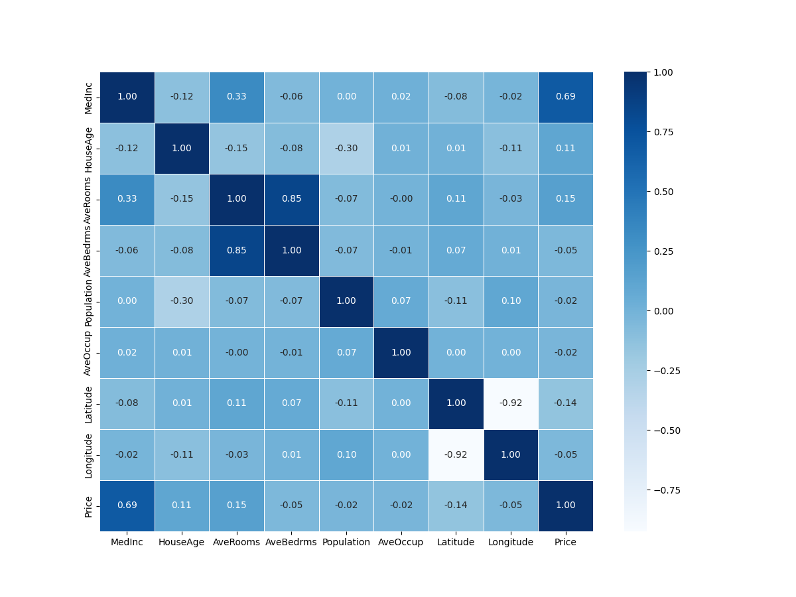
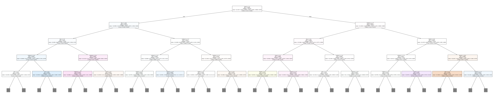
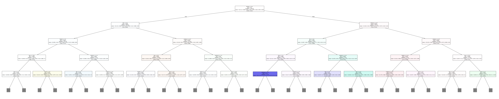

# 機械学驟雨(RF/線形回帰) 3I44 吉髙僚眞

## 目的
1. 機械学習とはどのようなものがあるかを知る。
1. sklearnモジュールにある線形回帰を使用して説明変数と目的変数の関係性を算出し，新たなデータから得られるデータの予測を行う。
1. sklearnモジュールにあるランダムフォレストを使用して入力データから次に出現するクラスを予想する。
1. モデル生成のパラメータを変えていき、学習内容と学習量の変化を確認する。
1. 学習結果を可視化して、人間では導きづらいであろう判定基準(学習によって作られた分類器)などを確認する。

## 実験1: 線形回帰

### ヒートマップ


#### 説明
ヒートマップは相関係数の表になっている。例えば、上から4行目「AveBedrms」と左から3列目「AveRooms」を見ると0.85となっていてこの2つには強い相関があることがわかる。このように、縦と横の要素がが交わったところの相関がわかる。強い正の相関があるところほど濃いで表示されている。また、コンソールには以下のように出力された。
```
Mean Squared Error: 0.5558915986952444
R^2 Score: 0.5757877060324508
```
Mean Squaerd Errorは平均二乗誤差。
R^2 Scoreは決定係数。決定係数は1に近いほどデータがうまく予測できてるという指標。

各説明変数の意味は以下のとおりである。
| 説明変数 | 意味 |
| --- | --- |
| Medlnc | 世帯所得の中央値 | 
| HouseAge | 住宅の築年数 |
| AveRooms | 住宅の部屋数の平均 |
| AveBedrms | 住宅の寝室数の平均 |
| Poplation	| 居住人数の合計 |
| AveOcuup | 世帯人数の平均 |
| Latitude | 各地区における代表地区の緯度 |
| Longitude | 各地区における代表地区の軽度 |

ヒートマップから読み取ると以下のようなことが言える。
* 「寝室数の平均」と「部屋数の平均」には強い正の相関(0.85)がある。
  * 住宅の部屋数が増えると寝室の数も増える傾向にあるといえる。
  * 普通に考えても妥当といえるだろう。
* 「世帯所得の中央値」と「住宅価格」には強い正の相関(0.69)がある。
  * 世帯所得が高いと住宅価格も高くなりやすいといえる。
  * お金を持っている人が高い家に住んでいることが多いというのは妥当といえるだろう。
* 「緯度」と「経度」には強い負の相関(-0.92)がある。
  * 緯度が高いと経度は低くなる傾向にあるといえる。
  * カリフォルニア州の形が影響しているだろう。
* 「居住人数の合計」と「築年数」には弱い負の相関(-0.30)がある。
  * 築年数が長いとと居住人数も少なるなる傾向にあるといえる。
  * 築年数が多いと子供が育って、同じ場所に住んでおらず、居住人数が少ないということだと考えた。
* 「世帯人数の平均」と「経度」、「緯度」には相関がない(0.00)。
  * 世帯人数と緯度経度には全く関係がないといえる。
  * 普通に考えても妥当といえるだろう。
* 「寝室数の平均」と「世帯所得の中央値」には弱い正の相関(0.33)がある。
  * 世帯所得が高いと住宅の寝室数も多い傾向があるといえる。
  * 寝室が多い、大きい家にお金を持っている人は住んでいることがおおいと考えた。
* 「築年数」と「世帯人数」の平均にはほとんど相関がなく(0.01)、関係がないといえる。
* 「部屋数」と「緯度」にはすこしだけ正の相関(0.11)が見られ、緯度が高いほどいわゆる高級住宅街のようになっていて、部屋の数が多い大きめの住宅が多いのかもしれない。
* 「築年数」と「経度」にはすこしだけ負の相関(-0.11)が見られ、経度が高いほど開発が行われていて築年数が少ない、新しめの建物が多いのかもしれない。
* 「寝室数」と「世帯人数」には相関がほとんど見られない(-0.01)。同じ部屋で寝る人が多いのかもしれない。
### 線形回帰式

| 要素 | 値 |
| --- | --- |
| MedInc   | 0.448675 |
| HouseAge | 0.009724 |
| AveRooms | -0.123323 |
| AveBedrms | 0.783145 |
| Population | -0.000002 |
| AveOccup | -0.003526 |
| Latitude | -0.419792 |
| Longitude | -0.433708 |

プログラムを実行すると上の表のようになった。これらの値は住宅価格を予想するための各要素の係数になっている。このことから次のことが言える。

* 世帯所得が高い、寝室数が多いと住宅価格も高くなる傾向がある。
* 築年数、居住人数、世帯人数には住宅価格はほとんど関係しない。
* 緯度、経度が低いと住宅価格が下がる傾向にある。
* （部屋数が多いと住宅価格が少しだけ下がる傾向にある。）


## 実験2: ランダムフォレストによる学習

### 決定木のキャプチャ画像



各桁に対して学習処理を行ったところ以下のような結果となった。

| 桁 | 学習スコア | テストスコア |
| --- | --- | --- |
| 1 | 1.0 | 0.10640394088669951 |
| 2 | 1.0 | 0.10197044334975369 |
| 3 | 1.0 | 0.10492610837438424 | 

決定木内のノードの
* giniは不純度、不平等度で高ければ高いほどまばらに散らばっている、0に近づけば近づくほど偏りがあることを示している。
* samplesはサンプル、当てはまったデータの割合を示している。

グラフの分岐はグラフの最初の分岐の左側だけを見ると以下のようになっている。

* 100の位が2.5以下
  * (T1) 日が14.5以下
    * (T2) 抽選番号の1の位が7.5以下
      * (T3) 抽選回数の4桁目が6.5以下
        * (T4) 抽選回数の10の位が7.5以下
          * (T5)...
          * (F5)...
        * (F4) 抽選回数の10の位が6.5以下
          * (T5)...
          * (F5)...
      * (F3) 抽選回数の4桁目が6.5以下
        * (T4) 抽選回数の4桁目が2.5以下
          * (T5)...
          * (F5)...
        * (F4) 抽選番号の100の位が0.5以下
          * (T5)...
          * (F5)...
    * (F2) 抽選回数の3桁目が7.5以下
      * (T3) 抽選回数の3桁目が5.5以下
        * (T4) 抽選回数の1桁目が5.5以下
          * (T5)...
          * (F5)...
        * (F4) 抽選回数の1桁目が4.5以下
          * (T5)...
          * (F5)...
      * (F3) 抽選回数の2桁目が1.5以下
        * (T4) 月が4.5以下
          * (T5)...
          * (F5)...
        * (F4) 日が22.5以下
          * (T5)...
          * (F5)...


## 実験3: 学習モデルからの予測

プログラムを実行すると以下のように表示された。
```
[3]
[2]
[4]
```

## 実験4: パラメータの変更

### 決定木の一部



### 設定したパラメータ
```python
forest = RandomForestClassifier(criterion='gini',n_jobs=-1,max_depth=300,n_estimators=300,bootstrap=True,min_samples_split=3)
```

### スコア
| 桁 | 学習スコア | テストスコア |
| --- | --- | --- |
| 1 | 1.0 | 0.11330049261083744 |
| 2 | 1.0 | 0.10049261083743842 |
| 3 | 1.0 | 0.09704433497536946 | 


```
[3]
[2]
[4]
```

同じ答えになってしまったが、葉の数を極端に変えたら、ちゃんとデータも変わったのでパラメータは動作するように設定できていて、同じ結果になったと考えられる。

ちなみに、次回の抽選結果を予測させたら以下のようになった。
```
[1]
[3]
[0]
```