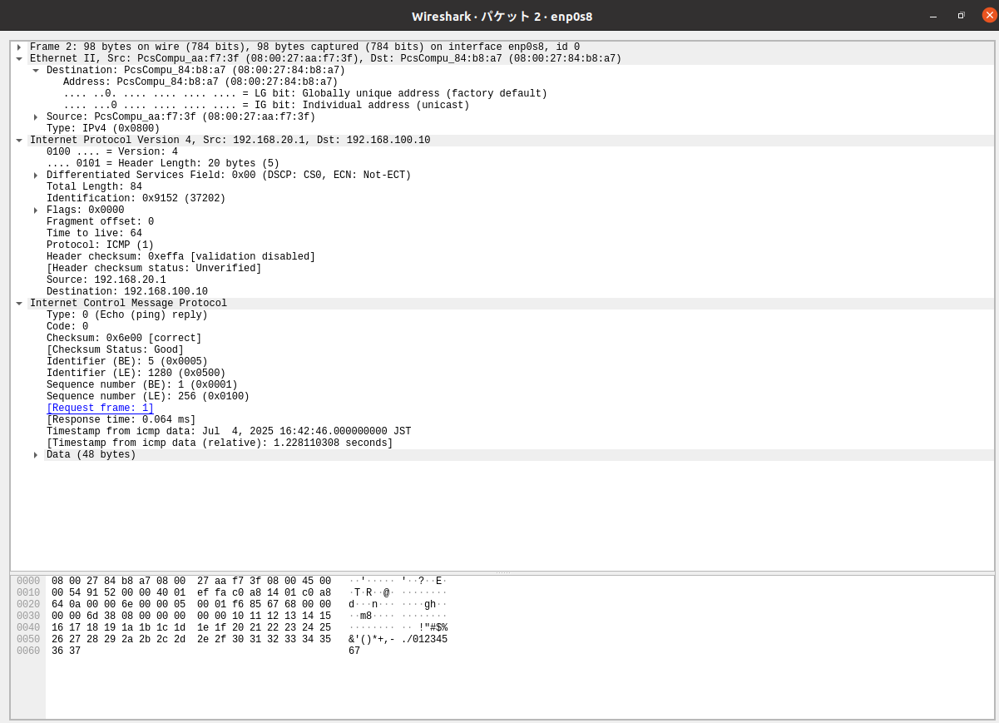

## ネットワーク レポート
3I44 吉髙僚眞

## 実験1: ネットワークインターフェース(NIC)とIPアドレス、ネットワーク

## ルーティング
### 動作確認

**[exp1-1]**

**[exp1-2]**

### ネットワーク図

### ルーティングテーブル

**[exp1-1]**
|　ネットワーク | ネクストホップ |
| --- | --- | 
| 192.168.10.0/24 | 直接接続 | 
| 192.168.100.0/24 | 直接接続 |
| 192.168.20.0/24 | 192.168.100.20 |

**[exp1-1]**
|　ネットワーク | ネクストホップ |
| --- | --- |
| 192.168.20.0/24 | 直接接続 | 
| 192.168.100.0/24 | 直接接続 |
| 192.168.10.0/24 | 192.168.100.10 |

## NAPT, IPマスカレード
### 動作確認

**[exp1-1]**

**[exp1-2]**

### ネットワーク図

**[exp1-1]**
|　ネットワーク | ネクストホップ | メトリック | 
| --- | --- | --- |
| 192.168.10.0/24 | 直接接続 | 0 |  
| 192.168.100.0/24 | 直接接続 | 0 |
| 192.168.20.0/24 | 192.168.100.20 | 1 |
| 10.0.4.0/24 | 192.168.100.20 | 1 |

**[exp1-2]**
|　ネットワーク | ネクストホップ | メトリック |
| --- | --- | --- | 
| 192.168.20.0/24 | 直接接続 | 0 |
| 192.168.100.0/24 | 直接接続 | 0 |
| 192.168.10.0/24 | 192.168.100.10 | 1 |
| 10.0.4.0/24 | 直接接続 | 0 |

## 実験2 Wiresharkを使ってパケットキャプチャする

### ネットワーク間
1. ICMPパケット一つ(往復分)を詳細を観察し、ICMPパケットの構造をレポートにまとめる

## 要求

## 応答

* ICMPプロトコルはOSI参照モデルで第3層ネットワーク層のプロトコルなので、イーサネットフレームのパケット、IPのパケットの後にある。
* ICMPパケットの構造
  * Type
  * Code
  * Checksum
  * Identifier(BE)
  * Identifier(LE)
  * Sequence number(BE)
  * Sequence(LE)
  * Timestamp
  * Data

  のような要素からなる。
* 要求と応答でTypeが異なっていることからその部分にはエコー要求の場合は8,エコー応答の場合は0が入ることがわかる。

### 外部との通信
1. キャプチャするNICの位置によって、ICMPパケット(IPフレーム)の内容がどのように変わっているか確認し、ex1-2で何が行われているか(実験1でex1-2に対してどのような設定を行ったのかを考えて)考察する。

## 要求

## 応答

* 1と比較するとIdentifiterがどちらも変わっていることがわかる。