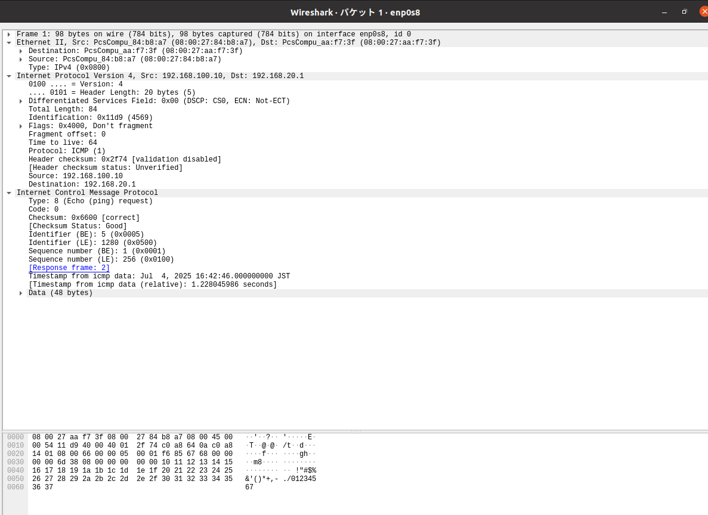

# ネットワーク レポート (3I44 吉髙僚眞)

## 目的
* インターネット層における、IPプロトコルを使ったIPルーティングについて理解し、どのようにIPパケットを伝送しているかを理解する。
* ubuntu(Linux)の基本的なネットワーク設定について理解する。
* Wiresharkを用いてパケットキャプチャを行い、IPパケット、MACフレームの構造について理解する。
* NATやNAPT(IPマスカレード)の目的と用途について理解する。

## 実験1: ネットワークインターフェース(NIC)とIPアドレス、ネットワーク

## ルーティング
### 動作確認

**[exp1-1]**

**[exp1-2]**

### ネットワーク図

### ルーティングテーブル

**[exp1-1]**
|　ネットワーク | ネクストホップ |
| --- | --- | 
| 192.168.10.0/24 | 直接接続 | 
| 192.168.100.0/24 | 直接接続 |
| 192.168.20.0/24 | 192.168.100.20 |

**[exp1-1]**
|　ネットワーク | ネクストホップ |
| --- | --- |
| 192.168.20.0/24 | 直接接続 | 
| 192.168.100.0/24 | 直接接続 |
| 192.168.10.0/24 | 192.168.100.10 |

## NAPT, IPマスカレード
### 動作確認

**[exp1-1]**

**[exp1-2]**

### ネットワーク図

**[exp1-1]**
|　ネットワーク | ネクストホップ | メトリック | 
| --- | --- | --- |
| 192.168.10.0/24 | 直接接続 | 0 |  
| 192.168.100.0/24 | 直接接続 | 0 |
| 192.168.20.0/24 | 192.168.100.20 | 1 |
| 10.0.4.0/24 | 192.168.100.20 | 1 |

**[exp1-2]**
|　ネットワーク | ネクストホップ | メトリック |
| --- | --- | --- | 
| 192.168.20.0/24 | 直接接続 | 0 |
| 192.168.100.0/24 | 直接接続 | 0 |
| 192.168.10.0/24 | 192.168.100.10 | 1 |
| 10.0.4.0/24 | 直接接続 | 0 |

## 実験2 Wiresharkを使ってパケットキャプチャする

### ネットワーク間
1. ICMPパケット一つ(往復分)を詳細を観察し、ICMPパケットの構造をレポートにまとめる

## 要求

| フィールド | 値 |
|-----------|--------------------------------|
| **Ethernet ヘッダ** | |
| 宛先 MAC          | 08:00:27:aa:f7:3f |
| 送信元 MAC        | 08:00:27:84:b8:a7 |
| EtherType         | IPv4 (0x0800) |
| **IP ヘッダ** | |
| 送信元 IP         | 192.168.100.10 |
| 宛先 IP           | 192.168.20.1 |
| Total Length      | 84 |
| Identification    | 4569(0x11d9) |
| Flags | Don't fragment (0x4000) |
| Frag Offset | 0 |
| TTL               | 64 (0x40) |
| Protocol          | ICMP (0x01) |
| Header Checksum   | 0x2f74 |
| **ICMP ヘッダ** | |
| Type              | 8 |
| Code              | 0 |
| Checksum          | 0x6600 |
| Identifier (BE)   | 5 |
| Identifier (BE)   | 1280 |
| Sequence Number (LE)  | 1 |
| Sequence Number (LE)  | 256 |

## 応答

| フィールド | 値 |
|-----------|--------------------------------|
| **Ethernet ヘッダ** | |
| 宛先 MAC          | 08:00:27:84:b8:a7 |
| 送信元 MAC        | 08:00:27:aa:f7:3f |
| EtherType         | IPv4(0x0800) |
| **IPv4 ヘッダ** | |
| 送信元 IP         | 192.168.20.1 |
| 宛先 IP           | 192.168.100.10 |
| Total Length      | 84 |
| Identification    | 37202(0x9152) |
| Flags | 0x0000 |
| Fragment offset | 0 |
| TTL               | 64(0x40) |
| Protocol          | ICMP(0x01) |
| Header Checksum   | 0x6e00 |
| **ICMP ヘッダ** | |
| Type              | 0 |
| Code              | 0 |
| Checksum          | 0x6e00 |
| Identifier (BE)   | 5 |
| Identifier (BE)   | 1280 |
| Sequence Number (LE)  | 1 |
| Sequence Number (LE)  | 256 |

#### ICMPヘッダの構造
* ICMPパケットは、L1のイーサネットヘッダ、L2のIPヘッダ、L3のICMPヘッダからなる。
* ICMPヘッダの構造
  * Type
  * Code
  * Checksum
  * Identifier(BE)
  * Identifier(LE)
  * Sequence number(BE)
  * Sequence(LE)
  * Timestamp
  * Data

  のような要素からなる。
* 要求と応答でTypeが異なっていることからその部分にはエコー要求の場合は8,エコー応答の場合は0が入ることがわかる。

### 外部との通信
1. キャプチャするNICの位置によって、ICMPパケット(IPフレーム)の内容がどのように変わっているか確認し、ex1-2で何が行われているか(実験1でex1-2に対してどのような設定を行ったのかを考えて)考察する。

## 要求

### enp0s8

### enp0s9

## 考察
この実験ではexp1-2でIPマスカレードする設定を追加したため、exp1-1のパケットがexp1-2でアドレス変換されているはずである。enp0s8で見ると、192.168.100.10から172.16.15.26に送られているが、enp0s9で見ると、10.0.4.15から172.16.15.26に送られている。そのため、正しくIPアドレスが変換されていると考えられる。

## 今回の実験で理解できたこと、できなかったこと
* インターネット層における、IPプロトコルを使ったIPルーティングについて理解し、どのようにIPパケットを伝送しているかは理解できたと思う。
* Linuxのネットワーク設定の方法については理解できた。
* Wiresharkを用いてパケットキャプチャを行う方法、IPパケット、MACフレームの構造について理解できた。
* NATやNAPT(IPマスカレード)の目的と用途について理解できた。