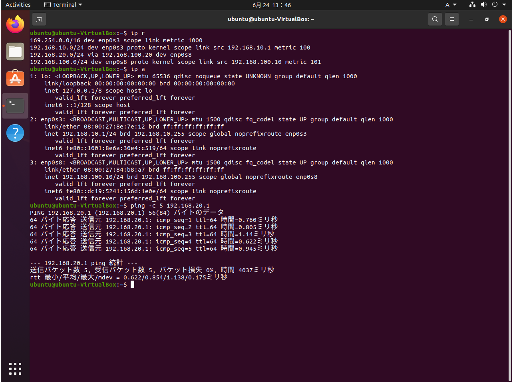
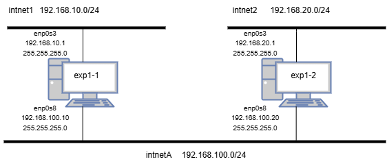
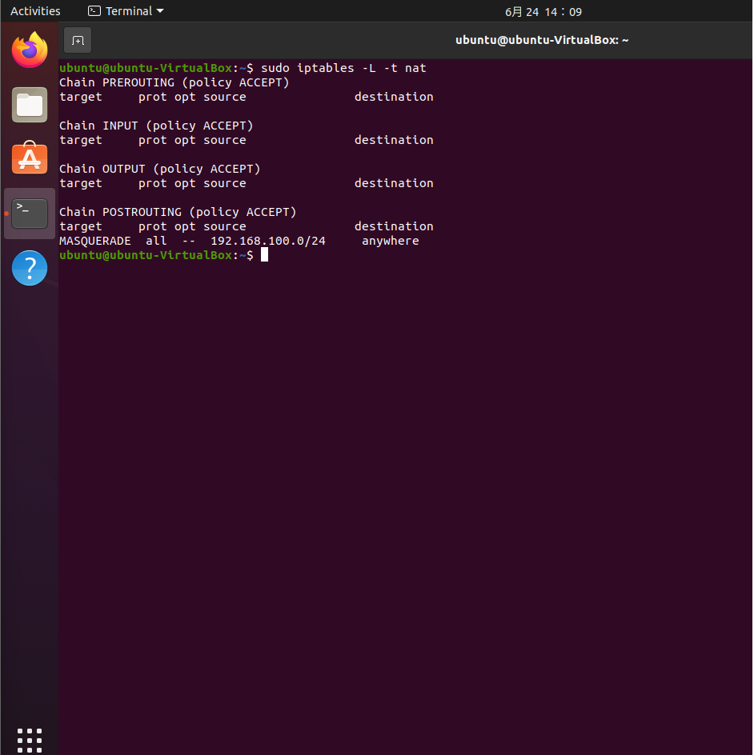
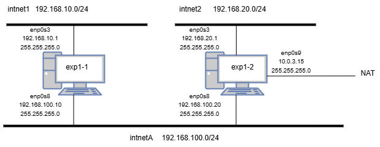

# ネットワーク レポート (3I44 吉髙僚眞)

## 目的
* インターネット層における、IPプロトコルを使ったIPルーティングについて理解し、どのようにIPパケットを伝送しているかを理解する。
* ubuntu(Linux)の基本的なネットワーク設定について理解する。
* Wiresharkを用いてパケットキャプチャを行い、IPパケット、MACフレームの構造について理解する。
* NATやNAPT(IPマスカレード)の目的と用途について理解する。

## 実験1: ネットワークインターフェース(NIC)とIPアドレス、ネットワーク

## ルーティング
### 動作確認

**[exp1-1]**

**[exp1-2]**

### ネットワーク図

### ルーティングテーブル

**[exp1-1]**
|　ネットワーク | ネクストホップ |
| --- | --- | 
| 192.168.10.0/24 | 直接接続 | 
| 192.168.100.0/24 | 直接接続 |
| 192.168.20.0/24 | 192.168.100.20 |

**[exp1-1]**
|　ネットワーク | ネクストホップ |
| --- | --- |
| 192.168.20.0/24 | 直接接続 | 
| 192.168.100.0/24 | 直接接続 |
| 192.168.10.0/24 | 192.168.100.10 |

## NAPT, IPマスカレード
### 動作確認

**[exp1-1]**

**[exp1-2]**

### ネットワーク図

**[exp1-1]**
|　ネットワーク | ネクストホップ | メトリック | 
| --- | --- | --- |
| 192.168.10.0/24 | 直接接続 | 0 |  
| 192.168.100.0/24 | 直接接続 | 0 |
| 192.168.20.0/24 | 192.168.100.20 | 1 |
| 10.0.4.0/24 | 192.168.100.20 | 1 |

**[exp1-2]**
|　ネットワーク | ネクストホップ | メトリック |
| --- | --- | --- | 
| 192.168.20.0/24 | 直接接続 | 0 |
| 192.168.100.0/24 | 直接接続 | 0 |
| 192.168.10.0/24 | 192.168.100.10 | 1 |
| 10.0.4.0/24 | 直接接続 | 0 |

## 実験2 Wiresharkを使ってパケットキャプチャする

### ネットワーク間
1. ICMPパケット一つ(往復分)を詳細を観察し、ICMPパケットの構造をレポートにまとめる

## 要求

| フィールド | 値 |
|-----------|--------------------------------|
| **Ethernet ヘッダ** | |
| 宛先 MAC          | 08:00:27:aa:f7:3f |
| 送信元 MAC        | 08:00:27:84:b8:a7 |
| EtherType         | 0x0800 |
| **IP ヘッダ** | |
| Version / IHL     | 0x45 |
| DSCP / ECN        | 0x00 |
| Total Length      | 0x0054 |
| Identification    | 0x2ef8 |
| Flags / Frag Offset | 0x4000 |
| TTL               | 0x40 |
| Protocol          | 0x01 |
| Header Checksum   | 0x1255 |
| 送信元 IP         | 192.168.100.10 |
| 宛先 IP           | 192.168.20.1 |
| **ICMP ヘッダ** | |
| Type              | 0x08 |
| Code              | 0x00 |
| Checksum          | 0xc214 |
| Identifier        | 0x000b |
| Sequence Number   | 0x0000 |

## 応答

| フィールド | 値 |
|-----------|--------------------------------|
| **Ethernet ヘッダ** | |
| 宛先 MAC          | 08:00:27:84:b8:a7 |
| 送信元 MAC        | 08:00:27:aa:f7:3f |
| EtherType         | 0x0800 |
| **IPv4 ヘッダ** | |
| Version / IHL     | 0x45 |
| DSCP / ECN        | 0x00 |
| Total Length      | 0x0054 |
| Identification    | 0x599c |
| Flags / Frag Offset | 0x0000 |
| TTL               | 0x40 |
| Protocol          | 0x01 |
| Header Checksum   | 0x27b1 |
| 送信元 IP         | 192.168.20.1 |
| 宛先 IP           | 192.168.100.10 |
| **ICMP ヘッダ** | |
| Type              | 0x00 |
| Code              | 0x00 |
| Checksum          | 0x9943 |
| Identifier        | 0x000d |
| Sequence Number   | 0x0001 |

#### ICMPヘッダの構造
* ICMPパケットは、L1のイーサネットヘッダ、L2のIPヘッダ、L3のICMPヘッダからなる。
* ICMPヘッダの構造
  * Type
  * Code
  * Checksum
  * Identifier(BE)
  * Identifier(LE)
  * Sequence number(BE)
  * Sequence(LE)
  * Timestamp
  * Data

  のような要素からなる。
* 要求と応答でTypeが異なっていることからその部分にはエコー要求の場合は8,エコー応答の場合は0が入ることがわかる。

### 外部との通信
1. キャプチャするNICの位置によって、ICMPパケット(IPフレーム)の内容がどのように変わっているか確認し、ex1-2で何が行われているか(実験1でex1-2に対してどのような設定を行ったのかを考えて)考察する。

## 要求

| フィールド | 値 |
|-----------|--------------------------------|
| **Ethernet ヘッダ** | |
| 宛先 MAC          | 08:00:27:aa:f7:3f |
| 送信元 MAC        | 08:00:27:84:b8:a7 |
| EtherType         | 0x0800 |
| **IPv4 ヘッダ** | |
| Version / IHL     | 0x45 |
| DSCP / ECN        | 0x00 |
| Total Length      | 0x0054 |
| Identification    | 0x1747 |
| Flags / Frag Offset | 0x4000 |
| TTL               | 0x40 |
| Protocol          | 0x01 |
| Header Checksum   | 0x4385 |
| 送信元 IP         | 192.168.100.10 |
| 宛先 IP           | 172.16.15.26 |
| **ICMP ヘッダ** | |
| Type              | 0x08 |
| Code              | 0x00 |
| Checksum          | 0x6986 |
| Identifier        | 0x000e |
| Sequence Number   | 0x0001 |

## 応答

| フィールド | 値 |
|-----------|--------------------------------|
| **Ethernet ヘッダ** | |
| 宛先 MAC          | 08:00:27:84:b8:a7 |
| 送信元 MAC        | 08:00:27:aa:f7:3f |
| EtherType         | 0x0800 |
| **IPv4 ヘッダ** | |
| Version / IHL     | 0x45 |
| DSCP / ECN        | 0x00 |
| Total Length      | 0x0054 |
| Identification    | 0x02ea |
| Flags / Frag Offset | 0x0000 |
| TTL               | 0x3c |
| Protocol          | 0x01 |
| Header Checksum   | 0x9be2 |
| 送信元 IP         | 172.16.15.26 |
| 宛先 IP           | 192.168.100.10 |
| **ICMP ヘッダ** | |
| Type              | 0x00 |
| Code              | 0x00 |
| Checksum          | 0x7186 |
| Identifier        | 0x000e |
| Sequence Number   | 0x0001 |

## 考察
この実験ではexp1-2でIPマスカレードする設定を追加したため、exp1-1のパケットがexp1-2でアドレス変換されているはずである。しかし、そのような変換は見られなかった、これはIPアドレスが変換される前のパケットを見ているからだと考えられる。

また、先ほどと異なっている部分を考えると、TTLが1つ下がっていることがわかる。これは外部のネットワークに出る時にルーター(exp1-2)が1つ値を減らしたからだと考えられる。

## 今回の実験で理解できたこと、できなかったこと
* インターネット層における、IPプロトコルを使ったIPルーティングについて理解し、どのようにIPパケットを伝送しているかは理解できたと思う。
* Linuxのネットワーク設定の方法については理解できた。
* Wiresharkを用いてパケットキャプチャを行う方法、IPパケット、MACフレームの構造について理解できた。
* NATやNAPT(IPマスカレード)の目的と用途について理解できた。