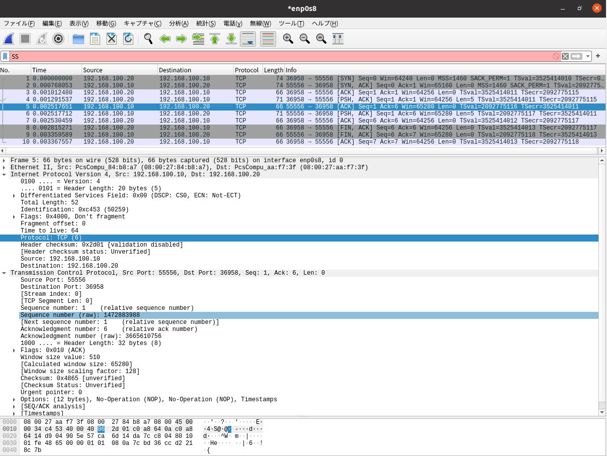

# ネットワーク2(ソケット通信) レポート (3I44 吉髙僚眞)

## 目的
* VirtualBox上のLinuxでサーバ・クライアントの実行環境を構築する
* ssh/sftpを使いリモート環境でプログラムを実行する方法を理解する
* pythonでソケット通信を使った簡単なプログラムを作成する
* パケットキャプチャによってTCPパケットの構造を理解する

## 環境構築

### IPアドレス

* exp1-1 192.168.56.101
* exp1-2 192.168.56.103


### ネットワーク図


### ルーティングテーブル

**[exp1-1]**
|　ネットワーク | ネクストホップ | メトリック | 
| --- | --- | --- |
| 192.168.10.0/24 | 直接接続 | 0 |  
| 192.168.100.0/24 | 直接接続 | 0 |
| 192.168.20.0/24 | 192.168.100.20 | 1 |
| 192.168.56.0/24 | 直接接続　| 0 |
| 10.0.4.0/24 | 192.168.100.20 | 1 |

**[exp1-2]**
|　ネットワーク | ネクストホップ | メトリック |
| --- | --- | --- | 
| 192.168.20.0/24 | 直接接続 | 0 |
| 192.168.100.0/24 | 直接接続 | 0 |
| 192.168.10.0/24 | 192.168.100.10 | 1 |
| 192.168.56.0/24 | 直接接続　| 0 |
| 10.0.4.0/24 | 直接接続 | 0 |

### プログラム変更差分
```shell
diff --git a/client/client.py b/client/client.py
index 440ff22..d26ecab 100644
--- a/client/client.py
+++ b/client/client.py
@@ -9,6 +9,9 @@ class EchoClient():
     port = 55556       # サーバのポート番号
     recv_size = 1024   # 受け取るデータの最大サイズ

+    def __init__(self, host=host):
+        self.host = host
+
     def send(self, msg):
         server_address = (self.host, self.port) # サーバのホスト名(IPアドレス)とポート番号

@@ -23,11 +26,14 @@ class EchoClient():
 def main():
     import argparse # コマンドラインパーサを導入
     parser = argparse.ArgumentParser(description='Echo client.')
+    
     parser.add_argument('msg', metavar='messege', help='message to server') # コマンドライン引数の文字列をmsgという変数に格納
+    parser.add_argument('--addr', dest='addr', default='127.0.0.1',help='IP address')
     args = parser.parse_args() # コマンドラインをパースして、解析し、適宜変数に値を入れる
-    # print(args.msg) # 今回の場合、args.msg にコマンドラインで指定した文字列が格納される
+    #print(args.msg) # 今回の場合、args.msg にコマンドラインで指定した文字列が格納される
+    #print(args.addr)

-    c = EchoClient()
+    c = EchoClient(host=args.addr)
     ret = c.send(args.msg)
     print(ret.decode('utf-8'))

diff --git a/server/server.py b/server/server.py
index b19ad04..de0c078 100644
--- a/server/server.py
+++ b/server/server.py
@@ -19,6 +19,9 @@ class EchoServer:
     port = 55556      # サーバのポート番号
     recv_size = 1024  # 一回に受信するデータの最大バイト数

+    def __init__(self, host=host):
+        self.host = host
+        
     def start(self):
         with socket.socket(socket.AF_INET, socket.SOCK_STREAM) as server_socket: # socket() ソケット作成
             server_socket.bind((self.host, self.port))  # bind() 待ち受け用に設定
@@ -40,8 +43,16 @@ class EchoServer:
             server_socket.close()

 def main():
-    s = EchoServer()
+    import argparse # コマンドラインパーサを導入
+    parser = argparse.ArgumentParser(description='Echo client.')
+
+    parser.add_argument('--addr', dest='addr', default='127.0.0.1',help='IP address')
+    args = parser.parse_args() # コマンドラインをパースして、解析し、適宜変数に値を入れる
+    #print(args.addr)
+
+    s = EchoServer(host=args.addr)
     s.start()
+    


# エントリーポイント
```

### 動作確認の結果
| server(exp1-1)のIP アドレス | 説明 | 接続可否(192.168.100.10) | 接続可否(192.168.10.1) |   
|  ---- | ---- | ---- | ---- |
| 192.168.100.10 | intnetA側のアダプタのアドレス | 可能 | 不可 |
| 192.168.10.1 | intnet1側のアダプタのアドレス | 不可 | 不可 |
| 127.0.0.1 | ループバックアドレス| 不可 | 不可 |
| 0.0.0.0 | ローカルマシンの全てのIPアドレス| 可能 | 不可 |

### 考察

* 192.168.100.10で接続できなかったのは、前回の実験で行った設定ではexp1-1からexp1-2にアクセスをするような設定は行い、exp1-1から`ping -c 5 192.168.20.1`が動くようになったが、exp1-2からexp1-1にアクセスする設定をしていなかったためだと考えられる。そのため、今回の課題ではclient側がexp1-2でserverがexp1-1なのでアクセスできなかった。

* 127.0.0.1で起動してしまうとexp1-1内からしかアクセスできないため動作しなった。

* 192.168.100.10ではexp1-2のIPアドレスも192.168.100.20となっていて同じネットワークにあるためアクセスできる。
0.0.0.0で起動するとローカルマシンのすべてのIPアドレスで待つことになるので、同様に192.

* 168.100.10からアクセスすることができる。

## 課題2


### 条件
* wireshark
  * クライアント側(exp1-2)
  * enp0s10
* server
  * 192.168.100.10で起動
  * 0.0.0.0(でき)
### シーケンスごとのパケット

### 1.クライアントからサーバーへの接続要求


* 対応する部分
  * client.py 19行目
    ```python
        client_socket.connect(server_address)       # connect() 接続
    ```
  * server.cpp 47行目
    ``` c++
        retCode = listen(fdAccept, backlog);
    ```
  * サーバー側で接続要求を受け取る

### 2.サーバーからクライアントへの接続許可


* 対応する部分
  * server.cpp 56行目
    ```c++
        fdOther = accept(fdAccept, (struct sockaddr *)&sin_client, &socklen);
    ```

### 3.接続確認


* サーバーと正しく接続できたことをクライアントから確認してる部分。


### 4. メッセージの送信


* メッセージとして送ったhelloがあることIPアドレスからからクライアントからサーバーへ送信している部分とわかる。
* 対応する部分
  * client.py 20行目
    ```python
        client_socket.send(msg.encode('utf-8')) # send() 送信
    ```

### 5. 送信確認


* サーバー側がクライアントからのメッセージを受け取ったことを確認するため送り返している。

### 6. メッセージの受信


* メッセージとして送ったhelloがあることとIPアドレスからからサーバーからクライアントへ送信している部分とわかる。
* 対応する部分
  * server.cpp 72行目
    ```c++
        if (send(fdOther, buf, recvMsgSize, 0) != recvMsgSize){
    ```

### 7. 受信確認


* クライアント側がサーバー側からのメッセージを受け取ったことを確認するため送り返している。

### 8. 接続終了要求


* 対応する部分
  * プログラムの終了

### 9. 接続終了


* 対応する部分
  * server.py 43行目
    ```python
        server_socket.close()
    ```
    
### 10. 接続終了確認


## 課題3

### プログラム変更差分

```shell
diff --git a/client/client.py b/client/client.py
index d26ecab..9efafe6 100644
--- a/client/client.py
+++ b/client/client.py
@@ -9,8 +9,9 @@ class EchoClient():
     port = 55556       # サーバのポート番号
     recv_size = 1024   # 受け取るデータの最大サイズ

-    def __init__(self, host=host):
+    def __init__(self, host=host, port=port):
         self.host = host
+        self.port = port

     def send(self, msg):
         server_address = (self.host, self.port) # サーバのホスト名(IPアドレス)とポート番号
@@ -29,11 +30,12 @@ def main():

     parser.add_argument('msg', metavar='messege', help='message to server') # コマンドライン引数の文字列をmsgという変数に格納
     parser.add_argument('--addr', dest='addr', default='127.0.0.1',help='IP address')
+    parser.add_argument('--port', dest='port', default=55556, type=int, help='port number')
     args = parser.parse_args() # コマンドラインをパースして、解析し、適宜変数に値を入れる
     #print(args.msg) # 今回の場合、args.msg にコマンドラインで指定した文字列が格納される
     #print(args.addr)

-    c = EchoClient(host=args.addr)
+    c = EchoClient(host=args.addr, port=args.port)
     ret = c.send(args.msg)
     print(ret.decode('utf-8'))

diff --git a/server/server.py b/server/server.py
index de0c078..24c4af5 100644
--- a/server/server.py
+++ b/server/server.py
@@ -19,8 +19,9 @@ class EchoServer:
     port = 55556      # サーバのポート番号
     recv_size = 1024  # 一回に受信するデータの最大バイト数

-    def __init__(self, host=host):
+    def __init__(self, host=host, port=port):
         self.host = host
+        self.port = port

     def start(self):
         with socket.socket(socket.AF_INET, socket.SOCK_STREAM) as server_socket: # socket() ソケット作成
@@ -45,12 +46,12 @@ class EchoServer:
 def main():
     import argparse # コマンドラインパーサを導入
     parser = argparse.ArgumentParser(description='Echo client.')
-
     parser.add_argument('--addr', dest='addr', default='127.0.0.1',help='IP address')
+    parser.add_argument('--port', dest='port', default=55556, type=int, help='port number')
     args = parser.parse_args() # コマンドラインをパースして、解析し、適宜変数に値を入れる
     #print(args.addr)

-    s = EchoServer(host=args.addr)
+    s = EchoServer(host=args.addr, port=args.port)
     s.start()
```

### 動作確認の方法と結果

* サーバー側で以下のように設定した。
  * ターミナル1
    ```shell
    python3 server.py --addr 192.168.100.10 --port 55557
    ```
  * ターミナル2
    ```shell
    python3 server.py --addr 192.168.100.10 --port 55555
    ```
* クライアント側で以下のコマンドを実行した。
  * ターミナル1
    ```shell
    python3 client.py --addr 192.168.100.10 --port 55557 hello1
    ```
  * ターミナル2
    ```shell
    python3 client.py --addr 192.168.100.10 --port 55555 hello2
    ```
* 実行結果
  * サーバー側
    * ターミナル1
      ```shell
      DEBUG:__main__:Connected by (192.168.100.20, 49272)
      DEBUG:__main__:Recieve: hello1
      DEBUG:__main__:Send: hello1
      ```
    * ターミナル2
      ```shell
      DEBUG:__main__:Connected by (192.168.100.20, 36660)
      DEBUG:__main__:Recieve: hello2
      DEBUG:__main__:Send: hello2
      ```
  * クライアント側
    * ターミナル1
      ```shell
      hello1
      ```
    * ターミナル2
      ```shell
      hello2
      ```

### パケットキャプチャの状態と結果

* クライアント側のenp0s10でパケットキャプチャを行った
* 上のような各ターミナルの設定で行った。

* ターミナル1


* ターミナル2


### 考察
ポートを違うもので待ち受けると、ポートごとにそれぞれに別に通信することができることがわかる。また、パケットキャプチャを見ると、TCPのプロトコルの情報にポート番号が正しく記録されていることがわかり、サーバーの送り先のポート番号が異なると、クライアント側も違うポート番号を使用してパケットを送信している。

## 課題4

### プログラム変更差分
```shell
diff --git a/client/client.py b/client/client.py
index 9efafe6..5655fe8 100644
--- a/client/client.py
+++ b/client/client.py
@@ -9,35 +9,31 @@ class EchoClient():
     port = 55556       # サーバのポート番号
     recv_size = 1024   # 受け取るデータの最大サイズ

-    def __init__(self, host=host, port=port):
-        self.host = host
+    def __init__(self,port=port):
         self.port = port

-    def send(self, msg):
+        self.client_socket = socket.socket(socket.AF_INET, socket.SOCK_STREAM)
         server_address = (self.host, self.port) # サーバのホスト名(IPアドレス)とポート番号
+        self.client_socket.connect(server_address)       # connect() 接続
+
+    def send(self, msg):
+        self.client_socket.send(msg.encode('utf-8')) # send() 送信
+        data = self.client_socket.recv(self.recv_size)   # recv() 受信

-        with socket.socket(socket.AF_INET, socket.SOCK_STREAM) as client_socket: # socket()ソケット生成
-            client_socket.connect(server_address)       # connect() 接続
-            client_socket.send(msg.encode('utf-8')) # send() 送信
-            data = client_socket.recv(self.recv_size)   # recv() 受信
-
-            return data
+        return data


 def main():
     import argparse # コマンドラインパーサを導入
     parser = argparse.ArgumentParser(description='Echo client.')

-    parser.add_argument('msg', metavar='messege', help='message to server') # コマンドライン引数の文字列をmsgという変数に格納
-    parser.add_argument('--addr', dest='addr', default='127.0.0.1',help='IP address')
     parser.add_argument('--port', dest='port', default=55556, type=int, help='port number')
     args = parser.parse_args() # コマンドラインをパースして、解析し、適宜変数に値を入れる
-    #print(args.msg) # 今回の場合、args.msg にコマンドラインで指定した文字列が格納される
-    #print(args.addr)
-
-    c = EchoClient(host=args.addr, port=args.port)
-    ret = c.send(args.msg)
-    print(ret.decode('utf-8'))
+
+    c = EchoClient(port=args.port)
+    for line in sys.stdin:
+        ret = c.send(line)
+        print(ret.decode('utf-8'))

 # エントリーポイント
 if __name__ == '__main__':


diff --git a/server/server.py b/server/server.py
index 24c4af5..de0c078 100644
--- a/server/server.py
+++ b/server/server.py
@@ -19,9 +19,8 @@ class EchoServer:
     port = 55556      # サーバのポート番号
     recv_size = 1024  # 一回に受信するデータの最大バイト数

-    def __init__(self, host=host, port=port):
+    def __init__(self, host=host):
         self.host = host
-        self.port = port

     def start(self):
         with socket.socket(socket.AF_INET, socket.SOCK_STREAM) as server_socket: # socket() ソケット作成
@@ -46,12 +45,12 @@ class EchoServer:
 def main():
     import argparse # コマンドラインパーサを導入
     parser = argparse.ArgumentParser(description='Echo client.')
+
     parser.add_argument('--addr', dest='addr', default='127.0.0.1',help='IP address')
-    parser.add_argument('--port', dest='port', default=55556, type=int, help='port number')
     args = parser.parse_args() # コマンドラインをパースして、解析し、適宜変数に値を入れる
     #print(args.addr)

-    s = EchoServer(host=args.addr, port=args.port)
+    s = EchoServer(host=args.addr)
     s.start()
```

### 動作確認の結果

* サーバー側
```shell
ubuntu@ubuntu-VirtualBox:~/server$ python3 server.py --addr 192.168.100.10 --port 55555
DEBUG:__main__:Connected by (192.168.100.20, 37094)
DEBUG:__main__:Recieve: abcdefg

DEBUG:__main__:Send: abcdefg

DEBUG:__main__:Recieve: ABCDEFG

DEBUG:__main__:Send: ABCDEFG
```

* クライアント側
```shell
ubuntu@ubuntu-VirtualBox:~/client$ python3 client.py --port 55555
abcdefg
abcdefg

ABCDEFG
ABCDEFG
```

以上から正しく行ごとに送受信ができてることがわかる。

### 考察
この課題から、ソケットを生成してからソケットを閉じるまでならいくつパケットを送信しても正しく動作することがわかった。


### git履歴

```shell
commit 62e42f33f064a6fbd9f9e789c999530b68584ff9 (HEAD -> main, origin/main, origin/HEAD)
Author: r05i42 <r05i42@ed.cc.suzuka-ct.ac.jp>
Date:   Tue Jul 1 17:06:17 2025 +0900

    tag: release-ex4

commit 24a72fe280957eca3b1468368dbd249ce17dfa36
Author: r05i42 <r05i42@ed.cc.suzuka-ct.ac.jp>
Date:   Tue Jul 1 16:17:19 2025 +0900

    tag: release-ex3

commit 56a57bac1fc7c1761a2aa3967808a1b8adc80ad9 (tag: release-ex1)
Author: r05i42 <r05i42@ed.cc.suzuka-ct.ac.jp>
Date:   Tue Jul 1 13:55:44 2025 +0900

    tag: release-ex1

commit 8941b90ad8d00b724365f6aa7d0bf6cb4e866be3
Author: github-classroom[bot] <66690702+github-classroom[bot]@users.noreply.github.com>
Date:   Mon Jun 30 09:45:55 2025 +0000

    Initial commit
```

##　今回の実験で理解したこと
開発するパソコンで行った変更を実際に動作するサーバーに送るには、VS Codeの拡張機能を使うと便利なのが分かった。今までこのような作業をするときは、FTPでプログラムを送るために別のアプリを立ち上げて、同期してみたいなことをしていたのですが、これを使ったらすごく開発効率が上がると思います。gitの機能としてlogやtagがあることとそれの使い方がよくわかりました。特にプログラムを変更していくような実験や課題があるときは、diffで差分を見れるのは便利だと思います。わざわざbranchを作って管理しなくてもtagで状態を戻せたりするのもすごく便利で今後使っていきたいです。サーバーとクライアントのTCPパケット通信がどのように行われているのか理解することができました。