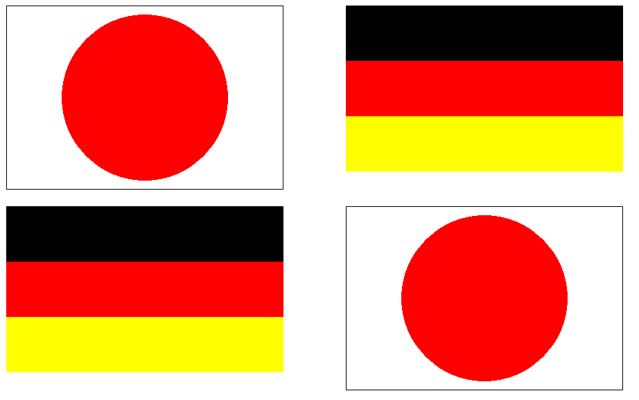

# GUIアプリケーション1

2I42 吉髙 僚眞

## 目的
　GUIアプリケーションの開発で求められる基礎知識について学ぶ。また，簡単な描画命令を使うことができるようになる。

## 調査１
> イベント駆動型プログラミングに関する次のキーワードを調査し説明せよ。
<dl>
	<dt>イベント</dt>
	<dd>アプリケーションに対して発生する事象のことである。例えば，「キーを押した/放した」「ある時間経過した」「描画しなければならなくなった」などである。</dd>
	<dt>ハンドラ</dt>
	<dd>...</dd>
</dl>

参考：[Wikipedia](https://ja.wikipedia.org/wiki/%E3%82%A4%E3%83%99%E3%83%B3%E3%83%88%E9%A7%86%E5%8B%95%E5%9E%8B%E3%83%97%E3%83%AD%E3%82%B0%E3%83%A9%E3%83%9F%E3%83%B3%E3%82%B0)

## 調査２
> 加法混色について調査し説明せよ。

加法混色とは...

参考：

## 調査３
> 1. 文字コードとは何か。日本語を表すことができる文字コードにはどのようなコードがあるか。
> 2. 文字化けとは何か。
1. ...
2. ...

参考：

## 演習１
 ウィンドウ中に 2 カ国の国旗を表示せよ。ただし，国旗毎に描画関数
 ```c++
 void Nation(HDC hdc, int left, int top); // 国旗の左上の座標(left, top)
 ```
 を作成し（関数名は国名に変える），以下のように呼び出すこと。その他，
  - 国旗の横幅は400pixelとすること
  - 2カ国合わせて3色以上もちいること
  - 引数で与えられた(left, top)から描画座標を求めること
  - 各国2か所以上表示すること

### 作成したコード
#### 1.日本国旗
> ```c++
> void Japan(HDC hdc, int left, int top) {
>    //長方形
>    SelectObject(hdc, GetStockObject(DC_PEN));
>    SelectObject(hdc, GetStockObject(DC_BRUSH));
>    SetDCPenColor(hdc, RGB(0, 0, 0));
>    SetDCBrushColor(hdc, RGB(255, 255, 255));
>    Rectangle(hdc, left, top, left + 400, top + 800/3);
>    
>    const int circleSize = 400 * 0.6;
>    const int circleStartX = (400 - circleSize) / 2;
>    const int circleStartY = (800/3 - circleSize) / 2;
>    const int circleEndX = circleStartX + circleSize;
>    const int circleEndY = circleStartY + circleSize;
>
>    //日の丸
>    SelectObject(hdc, GetStockObject(DC_PEN));
>    SelectObject(hdc, GetStockObject(DC_BRUSH));
>    SetDCPenColor(hdc, RGB(255, 0, 0));
>    SetDCBrushColor(hdc, RGB(255, 0, 0));
>    Ellipse(hdc, left + circleStartX, top + circleStartY,
>			 left + circleEndX, top + circleEndY);
> 	}
> ```
 #### 2.ドイツ国旗
> ``` c++
>void Germany(HDC hdc, int left, int top) {
>    //黒
>    SelectObject(hdc, GetStockObject(DC_PEN));
>    SelectObject(hdc, GetStockObject(DC_BRUSH));
>    SetDCPenColor(hdc, RGB(0, 0, 0));
>   SetDCBrushColor(hdc, RGB(0, 0, 0));
>    Rectangle(hdc, left, top, left + 400, top + 80);
>    //赤色
>    SelectObject(hdc, GetStockObject(DC_PEN));
>    SelectObject(hdc, GetStockObject(DC_BRUSH));
>    SetDCPenColor(hdc, RGB(255, 0, 0));
>    SetDCBrushColor(hdc, RGB(255, 0, 0));
>    Rectangle(hdc, left, top + 80, left + 400, top + 160);
>    //黄色
>    SelectObject(hdc, GetStockObject(DC_PEN));
>    SelectObject(hdc, GetStockObject(DC_BRUSH));
>    SetDCPenColor(hdc, RGB(255, 255, 0));
>    SetDCBrushColor(hdc, RGB(255, 255, 0));
>    Rectangle(hdc, left, top + 160, left + 400, top + 240);
>
>}
> ```

### 実行画像



## 演習２
色を 3 色以上，フォントを 3 種類以上，フォントサイズを 3 種類以上用いて，自分の氏名を派手に表示せよ。なお，フォントは c:\Windows\Fonts にあるファイルを参照のこと。

ワードアート的な感じで書く

## 学んだこと・感想など
