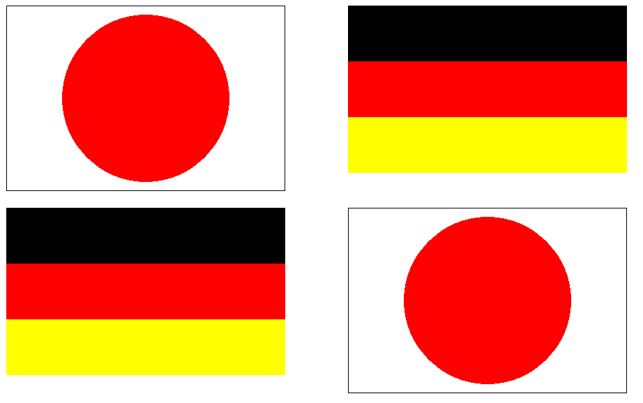
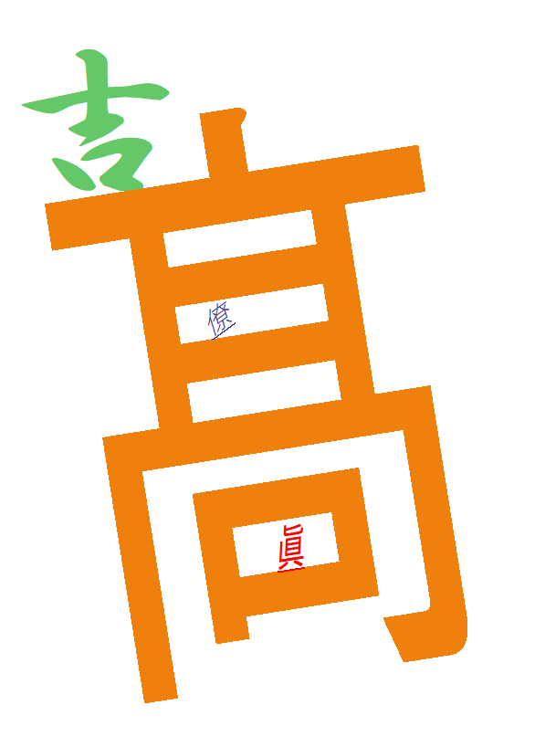

# GUIアプリケーション1

2I42 吉髙 僚眞

## 目的
GUIアプリケーションの開発で求められる基礎知識について学ぶ。また，簡単な描画命令を使うことができるようになる。

## 調査１
> イベント駆動型プログラミングに関する次のキーワードを調査し説明せよ。
<dl>
	<dt>イベント</dt>
	<dd>アプリケーションに対して発生する事象のことである。例えば，「キーを押した/放した」「ある時間経過した」「描画しなければならなくなった」などである。</dd>
	<dt>ハンドラ</dt>
	<dd>イベントが発生した際に実行すべきまとまった処理のこと。イベントフック、イベントリスナーなどの呼び方がある。</dd>
</dl>

参考：[Wikipedia](https://ja.wikipedia.org/wiki/%E3%82%A4%E3%83%99%E3%83%B3%E3%83%88%E9%A7%86%E5%8B%95%E5%9E%8B%E3%83%97%E3%83%AD%E3%82%B0%E3%83%A9%E3%83%9F%E3%83%B3%E3%82%B0)

## 調査２
> 加法混色について調査し説明せよ。


**加法混色とは...**
* 赤（R）・緑（G）・青（B）を組み合わせて色を表現する方法。
* 色を重ねるごとに明るくなり3角色を重ねると白になる。
* スポットライト、パソコンなどのディスプレイから発せられる色は加法混色で表現されている。

参考：[色の基本的な知識　加法混色と減法混色って何？ -Ad A Type Inc.-](https://www.dataplan.jp/blog/design/456)


## 調査３
> 1. 文字コードとは何か。日本語を表すことができる文字コードにはどのようなコードがあるか。
> 2. 文字化けとは何か。
1. ある文字をどのようなバイト列で表現するかを決めたルール。UTF-8やUnicodeなどの種類がある。
2. 保存された際の文字コードと異なる種類の文字コードで読み込むと正しく読むことができず文字化けが起こる。文字コードの種類によってバイト列と文字の対応が異なることが原因。

参考：[文字コードとは何なのか？ -4engineer.net-](https://4engineer.net/cs/character-encoding/#i)

## 演習１
 ウィンドウ中に 2 カ国の国旗を表示せよ。ただし，国旗毎に描画関数
 ```c++
 void Nation(HDC hdc, int left, int top); // 国旗の左上の座標(left, top)
 ```
 を作成し（関数名は国名に変える），以下のように呼び出すこと。その他，
  - 国旗の横幅は400pixelとすること
  - 2カ国合わせて3色以上もちいること
  - 引数で与えられた(left, top)から描画座標を求めること
  - 各国2か所以上表示すること

### ソースコード
#### 1.日本国旗
```c++
void Japan(HDC hdc, int left, int top) {
  //長方形
  SelectObject(hdc, GetStockObject(DC_PEN));
  SelectObject(hdc, GetStockObject(DC_BRUSH));
  SetDCPenColor(hdc, RGB(0, 0, 0));
  SetDCBrushColor(hdc, RGB(255, 255, 255));
  Rectangle(hdc, left, top, left + 400, top + 800/3);
    
  const int circleSize = 400 * 0.6;
  const int circleStartX = (400 - circleSize) / 2;
  const int circleStartY = (800/3 - circleSize) / 2;
  const int circleEndX = circleStartX + circleSize;
  const int circleEndY = circleStartY + circleSize;

  //日の丸
  SelectObject(hdc, GetStockObject(DC_PEN));
  SelectObject(hdc, GetStockObject(DC_BRUSH));
  SetDCPenColor(hdc, RGB(255, 0, 0));
  SetDCBrushColor(hdc, RGB(255, 0, 0));
  Ellipse(hdc, left + circleStartX, top + circleStartY,
	             left + circleEndX, top + circleEndY);
 	}
```
#### 2.ドイツ国旗
``` c++
void Germany(HDC hdc, int left, int top) {
  //黒
  SelectObject(hdc, GetStockObject(DC_PEN));
  SelectObject(hdc, GetStockObject(DC_BRUSH));
  SetDCPenColor(hdc, RGB(0, 0, 0));
  SetDCBrushColor(hdc, RGB(0, 0, 0));
  Rectangle(hdc, left, top, left + 400, top + 80);
  //赤色
  SelectObject(hdc, GetStockObject(DC_PEN));
  SelectObject(hdc, GetStockObject(DC_BRUSH));
  SetDCPenColor(hdc, RGB(255, 0, 0));
  SetDCBrushColor(hdc, RGB(255, 0, 0));
  Rectangle(hdc, left, top + 80, left + 400, top + 160);
  //黄色
  SelectObject(hdc, GetStockObject(DC_PEN));
  SelectObject(hdc, GetStockObject(DC_BRUSH));
  SetDCPenColor(hdc, RGB(255, 255, 0));
  SetDCBrushColor(hdc, RGB(255, 255, 0));
  Rectangle(hdc, left, top + 160, left + 400, top + 240);
}
```

### スクリーンショット



## 演習２
下記の条件に合うように自分の氏名を派手に表示せよ。
なお，フォントは c:\Windows\Fonts にあるファイルを参照のこと。
* 色を 3 色以上
* フォントを 3 種類以上
* フォントサイズを 3 種類以上

### ソースコード

1. 新規追加したグローバル変数
``` c++
//グローバル宣言 文字用
HFONT yoshi;
HFONT taka;
HFONT ryou;
HFONT ma;
TCHAR str[100];
```

2. WM_CREATE部分 (フォントの作成)
``` c++
case WM_CREATE:
    yoshi = CreateFont(200, 100, 45, 0, FW_DONTCARE,
                       FALSE, FALSE, FALSE, DEFAULT_CHARSET,
                       OUT_DEFAULT_PRECIS, CLIP_DEFAULT_PRECIS,
                       DEFAULT_QUALITY, DEFAULT_PITCH | FF_DONTCARE,
                       TEXT("HG行書体"));

    taka = CreateFont(700, 200, 90, 0, FW_DONTCARE,
                       FALSE, FALSE, FALSE, DEFAULT_CHARSET,
                       OUT_DEFAULT_PRECIS, CLIP_DEFAULT_PRECIS,
                       DEFAULT_QUALITY, DEFAULT_PITCH | FF_DONTCARE,
                       TEXT("HG創英角ポップ体"));

    ryou = CreateFont(40, 30, 360, 360, FW_DONTCARE,
                       TRUE, TRUE, FALSE, DEFAULT_CHARSET,
                       OUT_DEFAULT_PRECIS, CLIP_DEFAULT_PRECIS,
                       DEFAULT_QUALITY, DEFAULT_PITCH | FF_DONTCARE,
                       TEXT("游ゴシック"));
    ma = CreateFont(50, 30, 90, 50, FW_DONTCARE,
                        TRUE, TRUE, FALSE, DEFAULT_CHARSET,
                        OUT_DEFAULT_PRECIS, CLIP_DEFAULT_PRECIS,
                        DEFAULT_QUALITY, DEFAULT_PITCH | FF_DONTCARE,
                        TEXT("BIZ UDPゴシック"));
    break;
```

3. WM_PAIT部分 (フォントオブジェクトの削除)
``` c++
case WM_CLOSE:
    DeleteObject(yoshi);
    DeleteObject(taka);
    DeleteObject(ryou);
    DeleteObject(ma);
    DestroyWindow(hWnd);
    break;
```
4. WM_PAIT部分 (描画)
``` c++
case WM_PAINT:
  {
    PAINTSTRUCT ps;
    HDC hdc = BeginPaint(hWnd, &ps);
  
    SetBkMode(hdc, TRANSPARENT);
    SetTextColor(hdc, RGB(100, 200, 105));
    SelectObject(hdc, yoshi);
    lstrcpy(str, TEXT("吉"));
    TextOut(hdc, 1000, 120, str, lstrlen(str));

    SetBkMode(hdc, TRANSPARENT);
    SetTextColor(hdc, RGB(240, 128, 12));
    SelectObject(hdc, taka);
    lstrcpy(str, TEXT("髙"));
    TextOut(hdc, 1000, 200, str, lstrlen(str));

    SetBkMode(hdc, TRANSPARENT);
    SetTextColor(hdc, RGB(72, 61, 139));
    SelectObject(hdc, ryou);
    lstrcpy(str, TEXT("僚"));
    TextOut(hdc, 1210, 415, str, lstrlen(str));

    SetBkMode(hdc, TRANSPARENT);
    SetTextColor(hdc, RGB(255, 0, 0));
    SelectObject(hdc, ma);
    lstrcpy(str, TEXT("眞"));
    TextOut(hdc, 1300, 655, str, lstrlen(str));
    
    EndPaint(hWnd, &ps);
  }
  break;
 ```
<br>
<br>
<br>
<br>
<br>

### スクリーンショット


## 学んだこと・感想など
GUIアプリケーションを作るためには、イベントごとに処理を登録していき作成するということがわかりました。このようなアプリを作る際には変数のスコープにより注意したいなと思いました。
国旗の比率に合わせて、座標を計算するのが難しかったです。