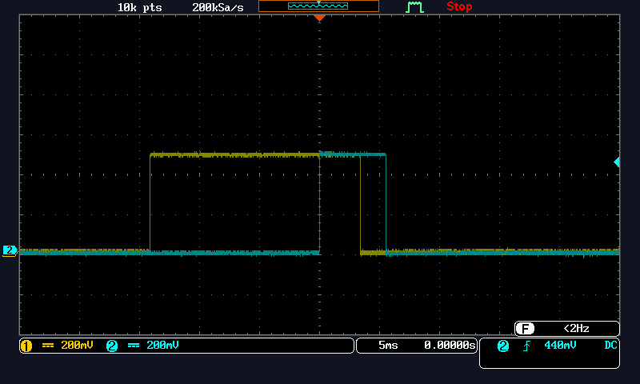
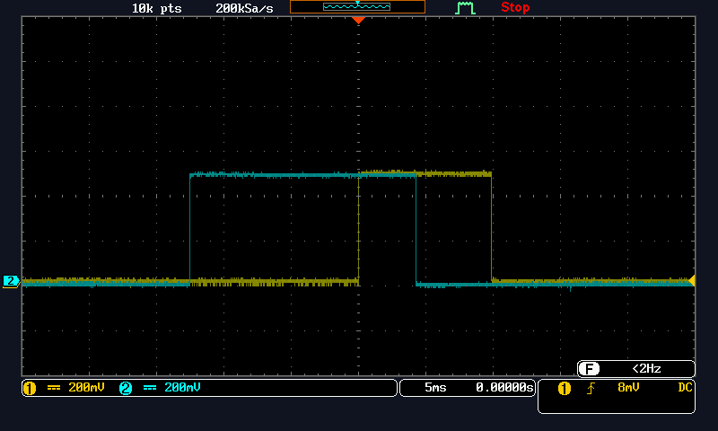

# ロータリーエンコーダ

## 目的
ロータリエンコーダは軸の回転方向および回転角度を検出するセンサである。ここでは２相の信号を出力するインクリメント型ロータリエンコーダを用い、マニュアルの読み方、使用方法を学ぶ。

## 実験概要
マニュアルには構造、使用方法、サンプルプログラムなどが掲載されている。これらは自分の開発言語や環境と異なる場合もあるが、使用上の注意事項等が含められており、プログラム作成時にはこれらに沿って作成するのがよい。なお、ここでは、割り込みを用いない。

## 実験

### 実験1
> インターフェースマニュアルを参照し、出力信号を調べよ。

1. 右回転するときは、A端子が先に H レベルになり、続いてB端子が H レベルになる。
2. 逆に左回転するときは、 B端子が先に H レベルになり、続いてA端子が H レベルになる。

### 実験2
> データシートを参照して、端子配列を調べなさい。

左から Power +5v, Output A, Output B, For Switch, For Switch, Power 0v
(上から見るとへこんでいる部分がある方が右側)

### 実験3
> ロータリエンコーダに電源５V を接続する。ロータリエンコーダを回しながら、A 端子、B 端子の波形をオシロスコープで確認しなさい。

* 右回転: 図中の(a)
* 左回転: 図中の(b)
* Output A -> CH1
* Output B -> CH2

### 波形

**(a)の方向**



**(b)の方向**


* (a)が右回転で、Aが先に出ている
* (b)が左回転で、Bが先に出ている
ので実験1は正しいといえる。

### 実験4
> インターフェースマニュアルを参照し、回転方向の検出方法を読み取りなさい。

1. スイッチが操作されるとき、チャタリング（コンタクトバウンス）が発生する。チ
ャタリングの除去法を読み取り、真理値表にしなさい。変化なしは「－」とせよ。

| A | B | rotary_q1 | rotary_q2 |
| --- | --- | --- | --- |
| L | L | L | - |
| L | H | - | H |
| H | L | - | L |
| H | H | H | - |

1. rotary_q1 の立ち上がりは回転したことを示す。(その時点で)rotary_q2 が`L`なら右回転、`H`なら左回転である。

1. タイミングチャートを完成せよ。


### 実験5
> PD2, PD3 にロータリエンコーダの出力 A,B を接続する。実験４．に基づいて、右回転なら LED を点灯、左回転なら LED を消灯するプログラムを作成せよ。

#### プログラム
```c
#include <asf.h>
int main(void)
{
	uint8_t A = 0, B = 0; // A 端子, B 端子の値
	uint8_t rotary_q1 = 0, rotary_q2 = 0, prev_rotary_q1 = 0;

	DDRD &= ~(1 << DDD2) & ~(1 << DDD3); // 入出力ポート設定
	DDRB |= (1 << DDB5);
	PORTB &= ~(1 << PORTB5);

	while (1)
	{
		A = (PIND & (1 << PIND2)) ? 1 : 0; // A 端子読み込み
		B = (PIND & (1 << PIND3)) ? 1 : 0; // B 端子読み込み
        
		// rotary_q1,rotary_q2 に変換（チャタリング除去）
		if(A == 0 && B == 0){
			rotary_q1 = 0;
			rotary_q2 = rotary_q2;
		}else if(A == 0 && B == 1){
			rotary_q1 = rotary_q1;
			rotary_q2 = 1;
		}else if(A == 1 && B == 0){
			rotary_q1 = rotary_q1;
			rotary_q2 = 0;
		}else if(A == 1 && B == 1){
			rotary_q1 = 1;
			rotary_q2 = rotary_q2;
		}		

		if (rotary_q1 != prev_rotary_q1)
		{ // rotary_q1 が変化して
			if (rotary_q1 == 1)
			{ // 立ち上がったら
				if (rotary_q2 == 0)
				{                         // 右回転なら
					PORTB |= 1 << PORTB5; // 点灯
				}
				else
				{     // 左回転なら
					PORTB &= ~(1 << PORTB5); // 消灯
				}
			}
			prev_rotary_q1 = rotary_q1; // 状態を更新
		}
	}
	return 0;
}
```

## 実験6
> 右に３クリック回したら LED を点灯せよ。途中、戻したらリスタートし、回し過ぎたら消灯するものとする。リスタートでは何をすべきか考えること。また、動作確認法についても考えること。

### プログラム
```c
#include <asf.h>
int main(void)
{
	uint8_t A = 0, B = 0; // A 端子, B 端子の値
	uint8_t rotary_q1 = 0, rotary_q2 = 0, prev_rotary_q1 = 0;
	uint8_t counter = 0;

	DDRD &= ~(1 << DDD2) & ~(1 << DDD3); // 入出力ポート設定
	DDRB |= (1 << DDB5);
	PORTB &= ~(1 << PORTB5);

	while (1)
	{
		A = (PIND & (1 << PIND2)) ? 1 : 0; // A 端子読み込み
		B = (PIND & (1 << PIND3)) ? 1 : 0; // B 端子読み込み
        
		// rotary_q1,rotary_q2 に変換（チャタリング除去）
		if (A == 0 && B == 0)
		{
			rotary_q1 = 0;
			rotary_q2 = rotary_q2;
		}
		else if (A == 0 && B == 1)
		{
			rotary_q1 = rotary_q1;
			rotary_q2 = 1;
		}
		else if (A == 1 && B == 0)
		{
			rotary_q1 = rotary_q1;
			rotary_q2 = 0;
		}
		else if (A == 1 && B == 1)
		{
			rotary_q1 = 1;
			rotary_q2 = rotary_q2;
		}

		if (rotary_q1 != prev_rotary_q1)
		{ // rotary_q1 が変化して
			if (rotary_q1 == 1)
			{ // 立ち上がったら
				if (rotary_q2 == 0)
				{ // 右回転なら
					counter++;
					if (counter == 3)
					{
						PORTB |= 1 << PORTB5;
					}
					else if (counter > 3)
					{
						PORTB &= ~(1 << PORTB5);
					}
				}
				else
				{
					counter = 0;
				}
			}
			prev_rotary_q1 = rotary_q1; // 状態を更新
		}
	}
	return 0;
}
```

* リスタート時には何クリック回右に回したかを格納している変数のcounterを0に戻している。
* 動作確認方法としては、ゆっくりロータリーエンコーダを回すことで1クリックずつ回転させることができ、右回転し、3クリック回したときにLEDが点灯することを確認し、左回転するとカウンターが0に戻っているかを確認する

## 実験7
> 右に３クリック、そして左に２クリック回したら、LED を点灯せよ。途中、戻したらリスタートし、回し過ぎたら消灯するものとする。（switch 文でフェーズに分けよ。）

### プログラム
```c
#include <asf.h>

int phase = 1;
int count = 0;

void start(void)
{
	count = 0;
	phase = 1;
}

int main(void)
{

	uint8_t A = 0, B = 0; // A 端子, B 端子の値
	uint8_t rotary_q1 = 0, rotary_q2 = 0, prev_rotary_q1 = 0;

	DDRD &= ~(1 << DDD2) & ~(1 << DDD3); // 入出力ポート設定
	DDRB |= (1 << DDB5);
	PORTB &= ~(1 << PORTB5);

	while (1)
	{
		A = (PIND & (1 << PIND2)) ? 1 : 0; // A 端子読み込み
		B = (PIND & (1 << PIND3)) ? 1 : 0; // B 端子読み込み
		if (A == 0 && B == 0)
		{
			rotary_q1 = 0;
			rotary_q2 = rotary_q2;
		}
		else if (A == 0 && B == 1)
		{
			rotary_q1 = rotary_q1;
			rotary_q2 = 1;
		}
		else if (A == 1 && B == 0)
		{
			rotary_q1 = rotary_q1;
			rotary_q2 = 0;
		}
		else if (A == 1 && B == 1)
		{
			rotary_q1 = 1;
			rotary_q2 = rotary_q2;
		}

		switch (phase)
		{
			case 1:
			if (rotary_q1 != prev_rotary_q1)
			{ // rotary_q1 が変化して
				if (rotary_q1 == 1)
				{ // 立ち上がったら
					if (rotary_q2 == 0)
					{ // 右回転なら
						count++;
						if (count == 3)
						{
							count = 0;
							phase = 2;
						}
					}
					else
					{
						start();
					}
				}
				prev_rotary_q1 = rotary_q1; // 状態を更新
			}
			break;
			case 2:
			if (rotary_q1 != prev_rotary_q1)
			{ // rotary_q1 が変化して
				if (rotary_q1 == 1)
				{ // 立ち上がったら
					if (rotary_q2 == 0)
					{ // 右回転なら
						start();
					}
					else
					{ // 左回転なら
						// PORTB |= 1 << PORTB5;
						count++;
						if (count == 2)
						{
							PORTB |= 1 << PORTB5; // 点灯
						}
						else if (count > 2)
						{
							PORTB &= ~(1 << PORTB5); // 消灯
						}
					}
				}
				prev_rotary_q1 = rotary_q1; // 状態を更新
			}
			break;
		}
	}
	return 0;
}


```

## 実験8
> 右に３クリック、左に２クリック、さらに右に２クリック回したら、LED を 1 秒間点灯せよ。途中、間違えたらリスタートするものとする。なお、ディレイ関数を利用してよい。動作フローを書き、プログラムによって確かめよ。

### 動作フロー

図をはる

### プログラム
```c
#include <asf.h>
#define F_CPU 20000000UL
#include <util/delay.h>

int phase = 1;
int count = 0;

void start(void)
{
	count = 0;
	phase = 1;
}

int main(void)
{

	uint8_t A = 0, B = 0; // A 端子, B 端子の値
	uint8_t rotary_q1 = 0, rotary_q2 = 0, prev_rotary_q1 = 0;

	DDRD &= ~(1 << DDD2) & ~(1 << DDD3); // 入出力ポート設定
	DDRB |= (1 << DDB5);
	PORTB &= ~(1 << PORTB5);

	while (1)
	{
		A = (PIND & (1 << PIND2)) ? 1 : 0; // A 端子読み込み
		B = (PIND & (1 << PIND3)) ? 1 : 0; // B 端子読み込み
		if (A == 0 && B == 0)
		{
			rotary_q1 = 0;
			rotary_q2 = rotary_q2;
		}
		else if (A == 0 && B == 1)
		{
			rotary_q1 = rotary_q1;
			rotary_q2 = 1;
		}
		else if (A == 1 && B == 0)
		{
			rotary_q1 = rotary_q1;
			rotary_q2 = 0;
		}
		else if (A == 1 && B == 1)
		{
			rotary_q1 = 1;
			rotary_q2 = rotary_q2;
		}

		switch (phase)
		{
			case 1:
			if (rotary_q1 != prev_rotary_q1)
			{ // rotary_q1 が変化して
				if (rotary_q1 == 1)
				{ // 立ち上がったら
					if (rotary_q2 == 0)
					{ // 右回転なら
						count++;
						if (count == 3)
						{
							count = 0;
							phase = 2;
						}
					}
					else
					{
						start();
					}
				}
				prev_rotary_q1 = rotary_q1; // 状態を更新
			}
			break;
			case 2:
			if (rotary_q1 != prev_rotary_q1)
			{ // rotary_q1 が変化して
				if (rotary_q1 == 1)
				{ // 立ち上がったら
					if (rotary_q2 == 0)
					{ // 右回転なら
						start();
					}
					else
					{ // 左回転なら
						count++;
						if (count == 2)
						{
							phase = 3;
							count = 0;
						}
					}
				}
				prev_rotary_q1 = rotary_q1; // 状態を更新
			}
			break;
			case 3:
			if (rotary_q1 != prev_rotary_q1)
			{ // rotary_q1 が変化して
				if (rotary_q1 == 1)
				{ // 立ち上がったら
					if (rotary_q2 == 0)
					{ // 右回転なら
						count++;
						if (count == 2)
						{
							PORTB |= 1 << PORTB5; // 点灯
							_delay_ms(1000);
							PORTB &= ~(1 << PORTB5); // 消灯
						}
						else if (count > 2)
						{
							start();
						}
					}
					else
					{ // 左回転なら
						start();
					}
				}
				prev_rotary_q1 = rotary_q1; // 状態を更新
			}
		}
	}
	return 0;
}
```

## 実験結果
> 各実験で行った動作確認パターンとその結果を記述せよ。

## 考察
> 下記項目について調べよ。
1. 実験１から単純に A 端子の立ち上がりで B 端子が L なら右回転、H なら左回転とすることがある。このとき、次のようにチャタリングが発生した場合、どのような動作となるか。（ヒント、回転と検出されるタイミングはどこかを図示せよ）

2. チャタリングの除去法を調べよ