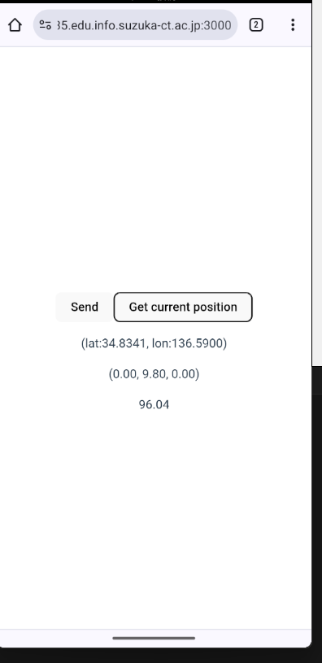
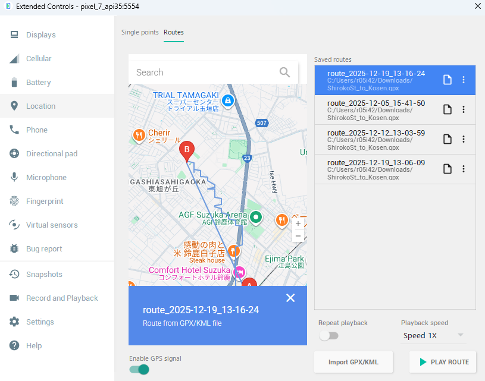
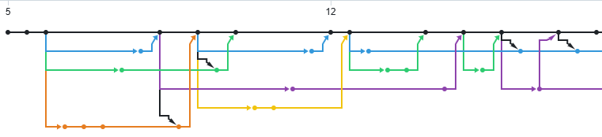
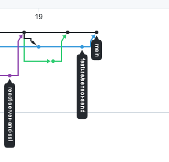
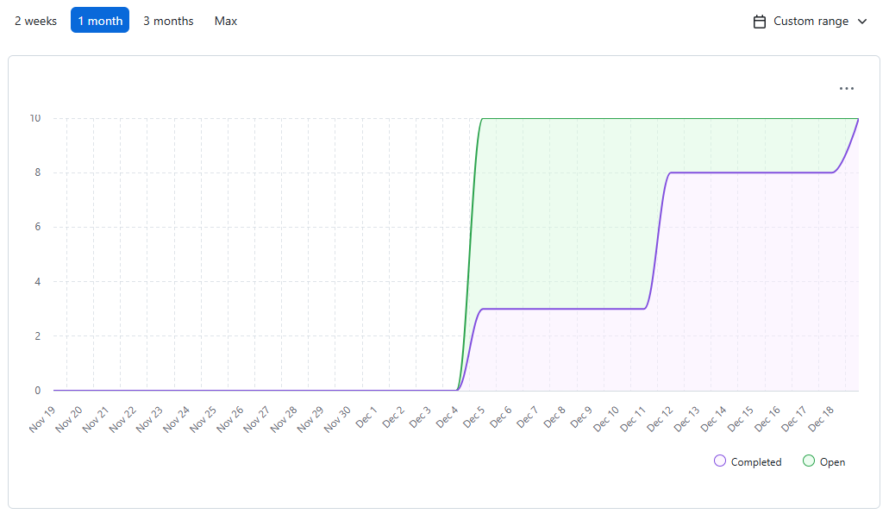

# チーム開発

3I44 吉髙僚眞

## 目的
* 一つのシステムを複数人からなるチームで構築するポイントや流れを理解する
* 一つのシステム(システムは複数のプログラムの集合体)を複数人で実装する経験を積む
* github projectを使ったタスク管理と、gitブランチを使った開発(pull request, review, merge)を実践する
* 開発だけではなく、運用を想定し、開発環境や使うツールの選定や整備を経験する
## 共同開発者
* 3I03 前田 彩花
* 3I06 石原 悠之介
* 3I13 岡田 凱吏

## 開発

### 自分が担当した開発部分 

学生用Webアプリ（センサークライアント）

実施したタスク
- スマートフォン上で動作するReactアプリケーション
- GPSと加速度センサからデータを取得
- Socket.IOでAPIサーバにデータを送信

### 開発部分が提供する機能

学生がスマホアプリを使用し、加速度センサの値が100m/s²を超えたヒヤリハットの状態の時に、位置情報、加速度センサの値等を送信し記録できるようにする。

### 開発部分のシステム構成


上図のようにスマホエミュレータ環境のブラウザからReactで作成したWebページを表示しAPIサーバーにWebsocketで接続し、データの送信を行う

### 開発部分の検証方法とその結果

Androidエミュレータを使用して、エミュレータ内のブラウザからアクセスして各機能が動作するかを確かめた。



エミュレータ内ではGPS、加速度を仮想的にシュミレートする機能がある。

この画面でモックのGPSデータを入力すると、ブラウザ上でそれに対応した位置情報が表示されていることを確認した。


この画面で、スマホを回転させたり、振ったりすると表示されているデータが変化していることを確認した。
また、スマホをドラッグして振ると加速度の閾値を超えた時だけデータが送信されていることを確認した。

データが正しく送信されているかについてはdocker上のログを見て確認した。
apiserver側で、gpsの情報、加速度の情報が正しく受け取れていることがわかる。

```
apiserver     | 2025-12-19 04:16:52,597 INFO sqlalchemy.engine.Engine COMMIT
apiserver     | tpI5kiSn-2Wx-8IkAAAC: Received packet MESSAGE data 2["accloc","{\"sess\":\"Txo-F6YXpk50kdZ8AAAD\",\"lat\":34.834103,\"lng\":136.5899994,\"accX\":-4.4,\"accY\":0,\"accZ\":9.5}"]
apiserver     | received event "accloc" from Txo-F6YXpk50kdZ8AAAD [/]
apiserver     | [2025-12-19 04:16:52,613] DEBUG in api: {"sess":"Txo-F6YXpk50kdZ8AAAD","lat":34.834103,"lng":136.5899994,"accX":-4.4,"accY":0,"accZ":9.5}
apiserver     | 2025-12-19 04:16:52,613 INFO sqlalchemy.engine.Engine BEGIN (implicit)
apiserver     | 2025-12-19 04:16:52,614 INFO sqlalchemy.engine.Engine INSERT INTO locdata (rectime, sess, lat, lng, "accX", "accY", "accZ", intensity) VALUES (%(rectime)s, %(sess)s, %(lat)s, %(lng)s, %(accX)s, %(accY)s, %(accZ)s, %(intensity)s) RETURNING locdata.id
apiserver     | 2025-12-19 04:16:52,614 INFO sqlalchemy.engine.Engine [cached since 135.3s ago] {'rectime': datetime.datetime(2025, 12, 19, 4, 16, 52, 614193), 'sess': 'Txo-F6YXpk50kdZ8AAAD', 'lat': 34.834103, 'lng': 136.5899994, 'accX': -4.4, 'accY': 0.0, 'accZ': 9.5, 'intensity': 109.61}
```

### リポジトリの「Insights」「Network」の図(各ブランチの開発状況)




### リポジトリの「Insights」「Contributors」の図(各自の開発状況)


### Github Projectの「Insights」「Burn up」を期間2025/12/5-2026/1/9の範囲で表示したもの。(作ったIssueと達成したIssueがわかるもの)



## 振り返り
チーム開発は助け合いが大事だと分かりました。また、開発の順番などにも注意する必要があることを理解しました。
チーム内で、可読性や管理のしやすさのためにコミットメッセージやプルリクエストのルールや変数名などのコーディングのルールをそろえることが必要なことがわかりました。それを忘れてしまいそうな時があったので今後のチーム開発で取り決めがあるときには忘れないようにしたいです。