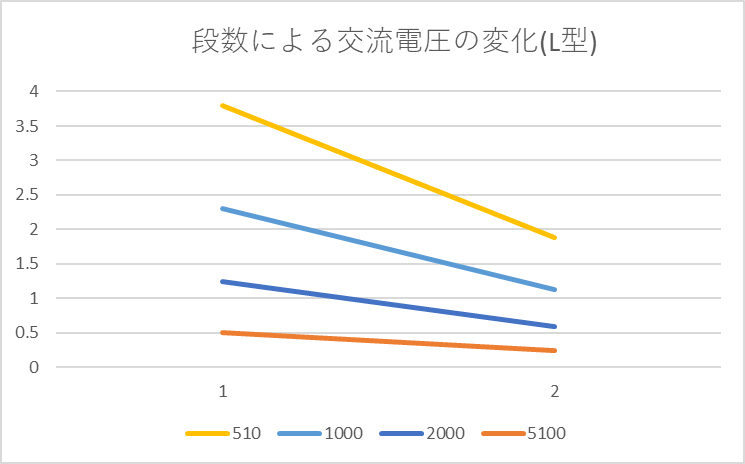
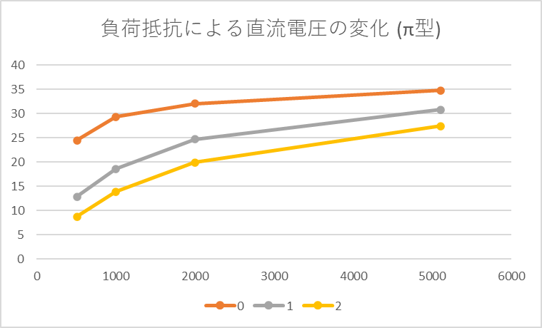
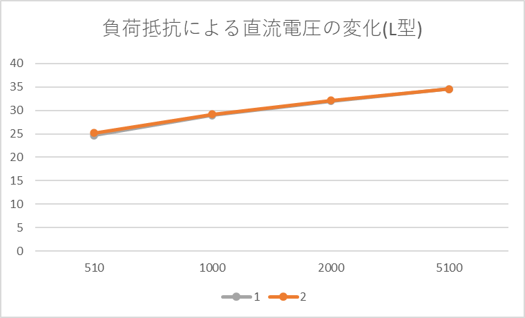

# 整流と平滑化

3I44 吉髙 僚眞

## 実施情報

### 環境
* 天候: 晴れ
* 気温: 28.4℃
* 湿度: 39.8%
* 使用装置: Desk9, 25

### 実験機器の設定
* コンデンサ: 47uF
* インダクタンス: 82uH

## 目的
正弦波電圧を直流電圧に変換するために必要な整流と平滑化の基礎的な事柄について実験を通して理解をする。

## 実験

測定を行ったところ以下のような結果となった。
(波形を表示している際のRlは510Ωである。)

### 1. 半端整流回路とπ型平滑回路による直流電源回路

### コンデンサ1個

**波形(AC/DC)**

**測定結果**
| Rl              | DCI          | DCV          | ACV          |
|:----------------|:-------------|:-------------|:-------------|
| 510             | 50.07        | 24.43        | 3.8          |
| 1000            | 30.55        | 29.28        | 2.3          |
| 2000            | 16.4         | 32.03        | 1.25         |
| 5100            | 0.702        | 34.75        | 0.52         |

### π型平滑回路1段

**波形(AC/DC)**

**測定結果**
| Rl              | DCI          | DCV          | ACV          |
|:----------------|:-------------|:-------------|:-------------|
| 510             | 25.77        | 12.85        | 0.15         |
| 1000            | 19.22        | 18.6         | 0.12         |
| 2000            | 12.58        | 24.7         | 0.08         |
| 5100            | 6.208        | 30.8         | 0.04         |

### π型平滑回路2段

**波形(AC/DC)**

**測定結果**
| Rl              | DCI          | DCV          | ACV          |
|:----------------|:-------------|:-------------|:-------------|
| 510             | 17.42        | 8.7          | 0.023        |
| 1000            | 14.23        | 13.86        | 0.023        |
| 2000            | 10.1         | 19.92        | 0.022        |
| 5100            | 5.52         | 27.42        | 0.018        |

### 2. 全波整流回路とL型平滑回路による直列電源回路
### L型平滑回路1段

**波形(AC/DC)**

**測定結果**
| Rl              | DCI          | DCV          | ACV          |
|:----------------|:-------------|:-------------|:-------------|
| 510             | 50.52        | 24.65        | 3.8          |
| 1000            | 30.23        | 28.95        | 2.3          |
| 2000            | 16.38        | 31.97        | 1.25         |
| 5100            | 6.97         | 34.55        | 0.51         |

### L型平滑回路2段
**波形(AC/DC)**

※ Rl = 510Ω

**測定結果**
| Rl              | DCI          | DCV          | ACV          |
|:----------------|:-------------|:-------------|:-------------|
| 510             | 51.5         | 25.15        | 1.88         |
| 1000            | 30.45        | 29.16        | 1.13         |
| 2000            | 16.48        | 32.13        | 0.59         |
| 5100            | 6.98         | 34.57        | 0.24         |

## 検討

### 1.各実験に対するリップル率γ
> 各実験に対するリップル率γを計算する．

#### π型平滑回路
| 段数 | 510        | 1000       | 2000       | 5100       |
|:----:|:-----------:|:-----------:|:-----------:|:-----------:|
| 0    | 0.155546459 | 0.078551913 | 0.039025913 | 0.014964029 |
| 1    | 0.011673152 | 0.006451613 | 0.003238866 | 0.001298701 |
| 2    | 0.002643678 | 0.001659452 | 0.001104418 | 0.000656455 |

#### L型平滑回路
| 段数 | 510        | 1000       | 2000       | 5100       |
|:----:|:-----------:|:-----------:|:-----------:|:-----------:|
| 1    | 0.154158215 | 0.079447323 | 0.039099155 | 0.014761216 |
| 2    | 0.074751491 | 0.038751715 | 0.018362901 | 0.006942436 |

計算結果より負荷抵抗の値を上げていくとリップル率は減少すること、段数を増やすとリップル率が減少することがわかる。

### 2.平滑回路の段数による出力電圧の変化
> π形平滑回路と L 形平滑回路のそれぞれにおいて、平滑回路の段数を増やすことによって、出力電圧はどのように変化したかを、γとスケッチした波形から検討する．

#### π型平滑回路

左がDCで測定したもの、右がACで測定したもの

コンデンサ1個

1段

2段

#### L型平滑回路
1段

2段

π型でもL型でも、平滑回路段数を増やしていくことにより、リップル率が減少し、もともとの交流回路の電圧波形をより直流回路の一定の電圧に近づくようになっている。

グラフを見ると段数を増やすごとに電圧が下がっていることがわかる。これは平滑回路で消費される電圧が多くなるからだと考えられる。

### 3.負荷抵抗によるによる出力電圧の変化
> 負荷抵抗を変えたことによる出力電流と、DC 出力電圧の関係をグラフに表す．π形平滑回路と L 形平滑回路の両方についてデータ整理を行い、出力電流が変化すると、出力電圧はどのように変化するかを検討する．

#### π型平滑回路

#### L型平滑回路

どちらの平滑回路でも、負荷抵抗を上げることにより直流電圧は増え、直流電流は減る関係があることがわかった。

横軸に電流、縦軸に電圧をとると、上記のようなグラフとなったこのことから、電流と電圧には比例のような関係があることがわかる。

## 研究

ダイオードブリッジを使用した全波整流回路を使うと上記のような波形が出る。

電流の流れとしては上記の様な感じで、交流の正負が逆転しても負荷抵抗には同じよう流れるため、示したような波形になる。
